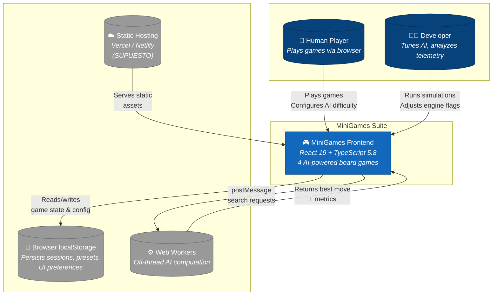
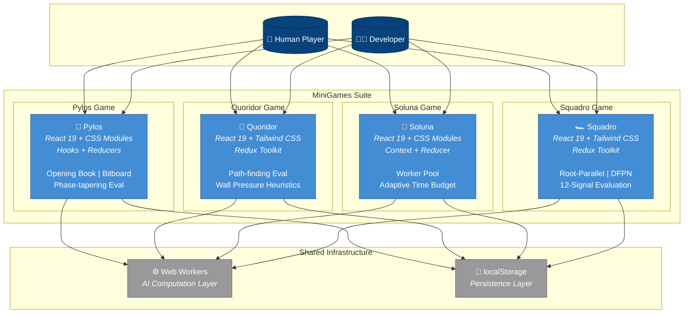
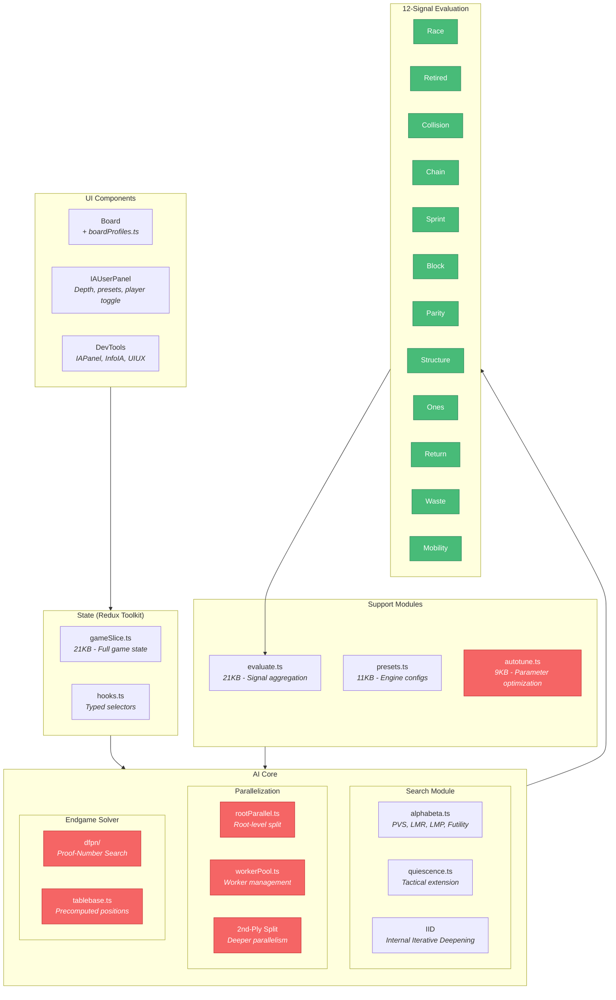
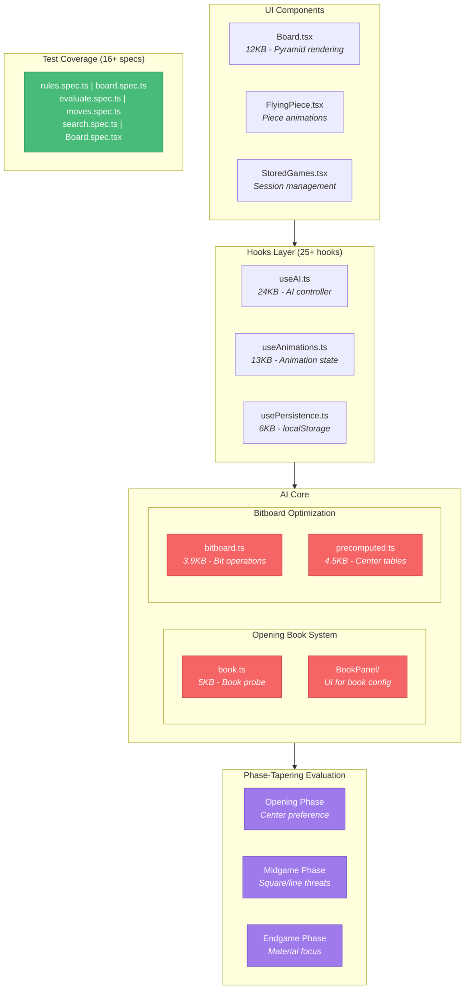
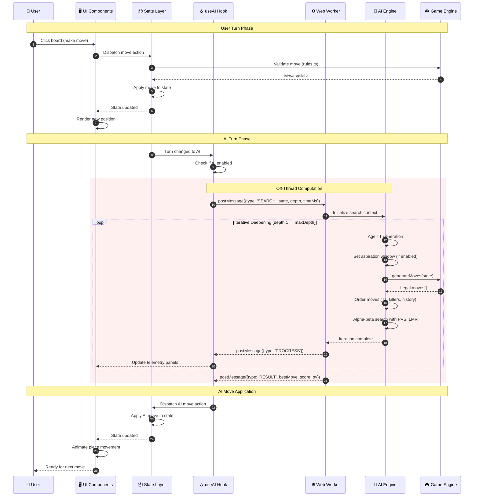
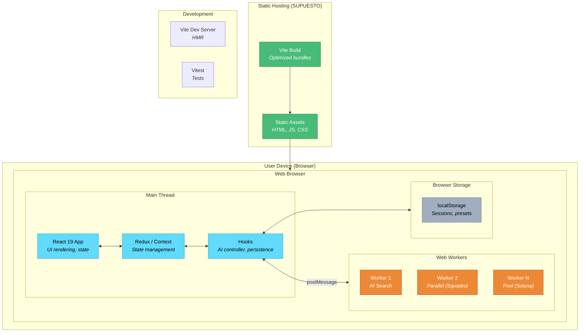

# MiniGames Suite — Architecture Documentation

> **Portfolio-ready architecture documentation** for a collection of four AI-powered abstract strategy board games.

---

## Table of Contents

- [Executive Summary](#executive-summary)
- [System Context](#system-context)
- [Container Architecture](#container-architecture)
- [Component Architecture](#component-architecture)
  - [Shared Layered Architecture](#shared-layered-architecture)
  - [Squadro-Specific Components](#squadro-specific-components)
  - [Pylos-Specific Components](#pylos-specific-components)
- [Critical Flow: AI Move Calculation](#critical-flow-ai-move-calculation)
- [Deployment Architecture](#deployment-architecture)
- [Technology Stack](#technology-stack)
- [Design Decisions & Trade-offs](#design-decisions--trade-offs)
- [Assumptions & Uncertainties](#assumptions--uncertainties)

---

## Executive Summary

**MiniGames Suite** is a collection of four fully-playable abstract strategy board games—**Pylos**, **Quoridor**, **Soluna**, and **Squadro**—each featuring:

- **Complete game engine** with rule enforcement, move validation, and win detection
- **Configurable AI opponent** using alpha-beta search with 10+ optimization techniques
- **Real-time telemetry** exposing search metrics, evaluation scores, and principal variation
- **Developer tooling** for AI tuning, simulation running, and debugging
- **Responsive UI** with animations, themes, and touch support

All computation runs **entirely client-side** in the browser, with AI search offloaded to Web Workers for UI responsiveness.

### Key Metrics

| Metric | Value |
|--------|-------|
| **Games** | 4 (Pylos, Quoridor, Soluna, Squadro) |
| **Total Source Files** | ~400+ TypeScript/TSX files |
| **AI Techniques** | 12+ (PVS, TT, LMR, DFPN, etc.) |
| **Test Suites** | 20+ spec files |
| **State Patterns** | Redux Toolkit, Context+Reducer |

---

## System Context

### What This Diagram Shows

The **Context Diagram** (C4 Level 1) establishes the system boundary and external interactions:

- **Human Player**: End user who plays games through the browser interface
- **Developer**: Uses DevTools panels for AI configuration and analysis
- **Browser localStorage**: Persistence layer for sessions, presets, and configuration
- **Web Workers**: Dedicated threads for AI computation (critical for UI responsiveness)
- **Static Hosting**: Deployment target (Vercel/Netlify based on roadmap)

### Technical Decisions

| Decision | Rationale |
|----------|-----------|
| **Client-side only** | Zero backend dependencies = simpler deployment, offline capability |
| **Web Workers for AI** | Main thread stays responsive during deep searches (5+ seconds) |
| **localStorage persistence** | Simple, synchronous, sufficient for game state and config |

### Trade-offs

- ✅ **Pros**: No server costs, instant deployment, works offline
- ⚠️ **Cons**: No multiplayer (yet), limited storage (~5MB), no cross-device sync

---

## Container Architecture

### What This Diagram Shows

The **Container Diagram** (C4 Level 2) shows the four game containers as independent applications sharing common infrastructure.

### Container Comparison

| Game | State Management | Styling | Unique AI Features |
|------|------------------|---------|-------------------|
| **Pylos** | Hooks + Reducers | CSS Modules | Opening Book, Bitboard, Phase-tapering |
| **Quoridor** | Redux Toolkit (3 slices) | Tailwind CSS | Path-finding, Wall pressure, Trace/Telemetry |
| **Soluna** | Context + Reducer | CSS Modules | Worker Pool, Adaptive time budget |
| **Squadro** | Redux Toolkit | Tailwind CSS | Root-Parallel, DFPN, 12-signal evaluation |

### Technical Decisions

| Decision | Rationale |
|----------|-----------|
| **Independent containers** | Each game can be deployed/tested independently |
| **Mixed state patterns** | Redux for complex state (Quoridor, Squadro), Context for simpler (Pylos, Soluna) |
| **Shared infrastructure** | Web Workers and localStorage are browser APIs, not shared code |

### Trade-offs

- ✅ **Pros**: Independent deployment, technology experimentation per game
- ⚠️ **Cons**: Some code duplication (AI patterns), no shared component library

---

## Component Architecture

### Shared Layered Architecture

All four games follow the same **layered architecture pattern**:

```mermaid
graph TB
    subgraph ui_layer ["UI Layer"]
        direction LR
        BOARD["Board<br/><i>Game visualization</i>"]
        PANELS["Panels<br/><i>Header, Footer, Info</i>"]
        MODAL["GameOverModal<br/><i>Win/Draw display</i>"]
        IAUSER["IAUserPanel<br/><i>Difficulty, presets</i>"]
    end

    subgraph devtools_layer ["DevTools Layer"]
        direction LR
        IAPANEL["IAPanel<br/><i>Engine flags, KPIs</i>"]
        INFOIA["InfoIA<br/><i>Simulations, charts</i>"]
        UIUX["UIUX<br/><i>Themes, animations</i>"]
        HISTORIAL["Historial<br/><i>Move history</i>"]
    end

    subgraph state_layer ["State Management Layer"]
        direction LR
        REDUX["Redux Toolkit<br/><i>Quoridor, Squadro</i>"]
        CONTEXT["Context + Reducer<br/><i>Pylos, Soluna</i>"]
    end

    subgraph hooks_layer ["Hooks Layer"]
        direction LR
        USEAI["useAI<br/><i>AI controller</i>"]
        USEHIST["useHistory<br/><i>Undo/redo</i>"]
        USEPERSIST["usePersistence<br/><i>localStorage</i>"]
    end

    subgraph ai_layer ["AI Engine Layer"]
        direction LR
        SEARCH["Search<br/><i>Alpha-beta, PVS, ID</i>"]
        EVAL["Evaluate<br/><i>Heuristic function</i>"]
        TT["Transposition Table<br/><i>Zobrist hashing</i>"]
        ORDERING["Move Ordering<br/><i>Killers, history</i>"]
    end

    subgraph game_layer ["Game Engine Layer"]
        direction LR
        RULES["Rules<br/><i>Move validation</i>"]
        BOARDLOGIC["Board<br/><i>State representation</i>"]
        TYPES["Types<br/><i>Domain models</i>"]
    end

    subgraph worker_layer ["Web Worker Layer"]
        WORKER["aiWorker.ts<br/><i>Off-thread execution</i>"]
    end

    subgraph persistence_layer ["Persistence Layer"]
        STORAGE["localStorage<br/><i>Sessions, presets, config</i>"]
    end

    ui_layer --> state_layer
    devtools_layer --> state_layer
    state_layer --> hooks_layer
    hooks_layer --> worker_layer
    worker_layer --> ai_layer
    ai_layer --> game_layer
    hooks_layer --> persistence_layer

    classDef uiStyle fill:#61dafb,stroke:#21a1c4,color:#000
    classDef devStyle fill:#ffd700,stroke:#b8860b,color:#000
    classDef stateStyle fill:#764abc,stroke:#4a2c7a,color:#fff
    classDef hookStyle fill:#68d391,stroke:#38a169,color:#000
    classDef aiStyle fill:#f56565,stroke:#c53030,color:#fff
    classDef gameStyle fill:#4299e1,stroke:#2b6cb0,color:#fff
    classDef workerStyle fill:#ed8936,stroke:#c05621,color:#fff
    classDef storageStyle fill:#a0aec0,stroke:#718096,color:#000

    class BOARD,PANELS,MODAL,IAUSER uiStyle
    class IAPANEL,INFOIA,UIUX,HISTORIAL devStyle
    class REDUX,CONTEXT stateStyle
    class USEAI,USEHIST,USEPERSIST hookStyle
    class SEARCH,EVAL,TT,ORDERING aiStyle
    class RULES,BOARDLOGIC,TYPES gameStyle
    class WORKER workerStyle
    class STORAGE storageStyle
```

### Layer Responsibilities

| Layer | Path | Responsibility |
|-------|------|----------------|
| **UI** | `src/components/` | Visual rendering, user interaction |
| **DevTools** | `src/components/DevTools/` | AI telemetry, engine config, debugging |
| **State** | `src/store/` or `src/game/store.tsx` | Global state, actions, selectors |
| **Hooks** | `src/hooks/` | AI controller, history, persistence |
| **AI Engine** | `src/ia/` | Search algorithms, evaluation, caching |
| **Game Engine** | `src/game/` | Rules, validation, state representation |
| **Worker** | `src/ia/worker/` | Off-thread AI execution |
| **Persistence** | localStorage | Sessions, presets, configuration |

### Technical Decisions

| Decision | Rationale |
|----------|-----------|
| **Strict layer separation** | Game rules never import UI; AI never imports state management |
| **Worker boundary** | AI engine is self-contained and can run in Worker context |
| **Hooks as controllers** | `useAI` orchestrates Worker communication and state updates |

---

### Squadro-Specific Components

Squadro has the most advanced AI implementation with **parallel search** and **endgame solving**:

### Squadro Unique Features

| Feature | File | Purpose |
|---------|------|---------|
| **Root-Parallel Search** | `rootParallel.ts` | Splits root moves across workers |
| **2nd-Ply Split** | Worker pool | Deeper parallelization level |
| **DFPN Solver** | `dfpn/` | Proof-number search for endgames |
| **12-Signal Evaluation** | `evaluate.ts` | Comprehensive position assessment |
| **Autotune** | `autotune.ts` | Parameter optimization framework |

---

### Pylos-Specific Components

Pylos features **opening book** support and **bitboard optimization**:

### Pylos Unique Features

| Feature | File | Purpose |
|---------|------|---------|
| **Opening Book** | `book.ts` | Precomputed opening moves |
| **Bitboard** | `bitboard.ts` | Fast bit-level operations |
| **Precomputed Tables** | `precomputed.ts` | Center preference lookup |
| **Phase-Tapering** | `evaluate.ts` | Evaluation changes by game phase |
| **16+ Test Suites** | `*.spec.ts` | Comprehensive test coverage |

---

## Critical Flow: AI Move Calculation

### What This Diagram Shows

The **Sequence Diagram** traces the critical path from user input to AI response:

1. **User Turn**: Click → Validate → Apply → Render
2. **AI Trigger**: State change detected by `useAI` hook
3. **Worker Communication**: `postMessage` API for thread isolation
4. **Iterative Deepening**: Progressive depth with time control
5. **Progress Streaming**: Real-time telemetry updates
6. **Result Application**: AI move applied with animation

### Technical Decisions

| Decision | Rationale |
|----------|-----------|
| **Iterative deepening** | Always have a valid move; deeper search if time permits |
| **Progress streaming** | User sees search activity; can cancel if needed |
| **Aspiration windows** | Narrow search bounds for faster cutoffs |
| **TT generation aging** | Prefer fresh entries over stale cached results |

---

## Deployment Architecture

### Deployment Characteristics

| Aspect | Details |
|--------|---------|
| **Build Tool** | Vite 7 with optimized production bundles |
| **Output** | Static HTML, JS, CSS (no server required) |
| **Hosting** | Any static host (Vercel, Netlify, GitHub Pages) |
| **Workers** | Bundled as separate chunks, loaded on demand |
| **Persistence** | Browser localStorage (~5MB limit) |

---

## Technology Stack

### Frontend Core

| Technology | Version | Purpose |
|------------|---------|---------|
| React | 19.1 | Component-based UI |
| TypeScript | 5.8 | Type safety |
| Vite | 7 | Build tool, HMR |
| Redux Toolkit | 2.9 | State management (Quoridor, Squadro) |
| Tailwind CSS | 4.1 | Utility-first styling |
| Vitest | 3.2 | Unit testing |
| ESLint | 9 | Code quality |

### AI Algorithms Implemented

| Technique | Purpose |
|-----------|---------|
| Negamax + Alpha-Beta | Core adversarial search |
| Principal Variation Search (PVS) | Narrow-window optimization |
| Iterative Deepening | Progressive depth with time control |
| Transposition Table (Zobrist) | Position caching |
| Killer Heuristic | Move ordering by cutoff history |
| History Heuristic | Global move-ordering signal |
| Late Move Reductions (LMR) | Depth reduction for late moves |
| Late Move Pruning (LMP) | Skip unpromising moves |
| Futility Pruning | Prune hopeless nodes |
| Aspiration Windows | Tighter search bounds |
| Quiescence Search | Tactical extension |
| Internal Iterative Deepening (IID) | Hash-move seed |
| DFPN (Squadro) | Proof-number endgame solver |
| Opening Book (Pylos) | Precomputed openings |

---

## Design Decisions & Trade-offs

### Architecture Decisions

| Decision | Rationale | Trade-off |
|----------|-----------|-----------|
| **Client-side only** | Zero backend, offline capable, simple deployment | No multiplayer, limited storage |
| **Web Workers for AI** | UI stays responsive during 5+ second searches | Worker communication overhead |
| **Mixed state patterns** | Right tool for each game's complexity | Some learning curve |
| **Independent containers** | Deploy/test games independently | Code duplication |
| **Layered architecture** | Clean separation, testable units | More files, indirection |

### AI Design Decisions

| Decision | Rationale | Trade-off |
|----------|-----------|-----------|
| **Iterative deepening** | Always have a move; deeper if time permits | Repeated work at shallow depths |
| **Per-iteration TT** | Fresh entries preferred | Memory churn |
| **Game-specific evaluation** | Tailored heuristics per game | No shared evaluation code |
| **Worker pool (Soluna/Squadro)** | Parallel search for speed | Complexity, synchronization |

---

## Assumptions & Uncertainties

### Assumptions

| ID | Assumption | Basis |
|----|------------|-------|
| A1 | No backend server exists | No server code found in repository |
| A2 | Deployment target is static hosting | README roadmap mentions Vercel/Netlify |
| A3 | `peg-solitario-game` is incomplete | Directory is empty (0 items) |
| A4 | Python modules are research tools | Separate from frontend architecture |

### Uncertainties

| ID | Uncertainty | Impact |
|----|-------------|--------|
| U1 | Exact deployment configuration | Deployment diagram is partially assumed |
| U2 | CI/CD pipeline | No configuration files detected |
| U3 | IndexedDB usage extent | Mentioned in utils but unclear scope |
| U4 | Production performance metrics | No profiling data available |

---

## File Index

| File | Description |
|------|-------------|
| `architecture.json` | Machine-readable architecture specification |
| `diagrams/context.mmd` | System context diagram (C4 Level 1) |
| `diagrams/containers.mmd` | Container diagram (C4 Level 2) |
| `diagrams/components-shared.mmd` | Shared layered architecture |
| `diagrams/components-squadro.mmd` | Squadro-specific components |
| `diagrams/components-pylos.mmd` | Pylos-specific components |
| `diagrams/sequence-ai-move.mmd` | AI move calculation flow |
| `diagrams/deployment.mmd` | Deployment architecture |

---

  <em>Architecture documentation generated for portfolio presentation</em> 
  <strong>Gabriel Astudillo Roca</strong>

