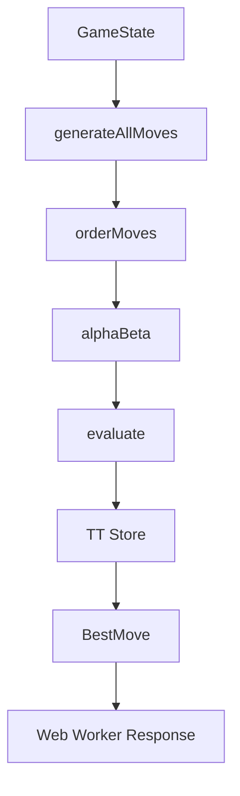

# 🧠 IA de Pylos: Análisis Técnico Profundo

## 📋 Tabla de Contenidos

1. [Arquitectura General](#arquitectura-general)
2. [Algoritmo de Búsqueda Principal](#algoritmo-de-búsqueda-principal)
3. [Función de Evaluación](#función-de-evaluación)
4. [Optimizaciones y Heurísticas](#optimizaciones-y-heurísticas)
5. [Transposition Table](#transposition-table)
6. [Quiescence Search](#quiescence-search)
7. [Move Ordering](#move-ordering)
8. [Bitboards y Precomputación](#bitboards-y-precomputación)
9. [Libro de Aperturas](#libro-de-aperturas)
10. [Web Workers y Paralelización](#web-workers-y-paralelización)

---

## 🏗️ Arquitectura General

### **Estructura Modular**
```
src/ia/
├── index.ts              # Punto de entrada principal
├── search/
│   └── search.ts         # Motor de búsqueda alpha-beta
├── evaluate.ts           # Función de evaluación heurística
├── moves.ts              # Generación y aplicación de movimientos
├── tt.ts                 # Transposition table
├── zobrist.ts            # Hashing de estados
├── bitboard.ts           # Representación eficiente del tablero
├── book.ts               # Libro de aperturas
├── precomputed.ts        # Datos precalculados
├── config.ts             # Configuración de flags en runtime
├── signature.ts          # Firmas de movimientos
└── worker/
    └── aiWorker.ts       # Web Worker para cálculo asíncrono
```

### **Flujo de Procesamiento**


---

## 🔍 Algoritmo de Búsqueda Principal

### **Negamax con Alpha-Beta Pruning**

El motor utiliza **Negamax** con poda **alpha-beta** implementado en `search/search.ts`:

```typescript
function alphaBeta(
  state: GameState,
  depth: number,
  alpha: number,
  beta: number,
  me: Player,
  stats?: SearchStats,
  opts?: SearchOptions,
  ply: number = 0,
  killers?: Killers,
  history?: HistoryMap
): SearchResult
```

#### **Características Clave**

1. **Fail-Soft Alpha-Beta**: Devuelve la mejor puntuación encontrada incluso si está fuera de la ventana [alpha, beta]
2. **Iterative Deepening**: Búsqueda progresiva por profundidades crecientes
3. **Aspiration Windows**: Búsqueda alrededor de puntuaciones esperadas para mayor eficiencia
4. **Time Management**: Control estricto del tiempo de búsqueda con deadlines

#### **Pseudocode del Algoritmo Principal**
```typescript
function negamax(state, depth, alpha, beta, player):
    if depth == 0 or isTerminal(state):
        return evaluate(state, player)
    
    // TT lookup
    if ttHit := TT.probe(state):
        if ttHit.depth >= depth:
            return ttHit.score
    
    moves := generateMoves(state)
    moves := orderMoves(moves, hints)
    
    bestScore := -∞
    for move in moves:
        child := applyMove(state, move)
        score := -negamax(child, depth-1, -beta, -alpha, opponent(player))
        
        if score > bestScore:
            bestScore := score
            bestMove := move
        
        alpha := max(alpha, score)
        if alpha >= beta:  // Beta cutoff
            break
    
    // TT store
    TT.store(state, depth, bestScore, bestMove)
    return bestScore
```

---

## 📊 Función de Evaluación

### **Arquitectura de Evaluación**

La función de evaluación en `evaluate.ts` utiliza un enfoque **multi-fase** con **tapering**:

```typescript
export function evaluate(state: GameState, me: Player): number {
  const phase = detectPhase(state);
  const weights = getPhaseWeights(phase);
  
  return (
    weights.material * materialScore(state, me) +
    weights.position * positionalScore(state, me) +
    weights.threats * threatScore(state, me) +
    weights.opportunities * opportunityScore(state, me)
  );
}
```

#### **Componentes Principales**

1. **Material Advantage**
   - Esferas en reserva: +10 puntos por esfera
   - Control de niveles: +5 por nivel superior controlado

2. **Positional Evaluation**
   - Control del centro: Precomputed center bonuses
   - Altura promedio: +2 por nivel de altura promedio
   - Soporte estructural: +3 por soporte de cuadrados

3. **Threat Assessment**
   - Cuadrados casi completos: +15 por cuadrado a 1 pieza
   - Amenazas de recuperación: +8 por recuperación posible
   - Control de niveles críticos: +6 por nivel 3-4 controlado

4. **Opportunity Analysis**
   - Recuperaciones inmediatas: +20 por recuperación disponible
   - Oportunidades futuras: +5 por potencial de recuperación a 2 movimientos
   - Control de jugada: +2 por tener más opciones

#### **Phase Tapering**

```typescript
function getPhaseWeights(phase: 'opening' | 'middle' | 'endgame'): EvalWeights {
  switch (phase) {
    case 'opening':
      return { material: 1.0, position: 0.8, threats: 0.6, opportunities: 0.4 };
    case 'middle':
      return { material: 0.9, position: 1.0, threats: 0.8, opportunities: 0.6 };
    case 'endgame':
      return { material: 0.7, position: 0.9, threats: 1.0, opportunities: 0.8 };
  }
}
```

---

## ⚡ Optimizaciones y Heurísticas

### **Principal Variation Search (PVS)**

```typescript
function pvs(state, depth, alpha, beta, player):
    moves := orderMoves(state)
    firstMove := moves[0]
    
    // Full search on first move
    score := -negamax(applyMove(state, firstMove), depth-1, -beta, -alpha, opponent(player))
    
    if score > alpha:
        alpha := score
        if score >= beta:
            return score
    
    // Null window search on remaining moves
    for i = 1 to moves.length-1:
        move := moves[i]
        score := -negamax(applyMove(state, move), depth-1, -alpha-1, -alpha, opponent(player))
        
        if score > alpha && score < beta:
            // Full re-search if null window failed
            score := -negamax(applyMove(state, move), depth-1, -beta, -alpha, opponent(player))
        
        if score > alpha:
            alpha := score
            if score >= beta:
                break
    
    return alpha
```

### **Late Move Reductions (LMR)**

```typescript
function shouldReduce(depth, moveIndex, tactical): boolean {
  return depth >= 3 && 
         moveIndex >= 4 && 
         !tactical && 
         depth > lmrMinDepth;
}

function reducedDepth(depth, moveIndex): number {
  return depth - 1;  // Simple reduction
}
```

### **Killer Heuristic**

```typescript
interface Killers {
  [ply: number]: [MoveSignature | 0, MoveSignature | 0];
}

function updateKillers(killers: Killers, ply: number, move: MoveSignature): void {
  const [first, second] = killers[ply] || [0, 0];
  if (move !== first) {
    killers[ply] = [move, first];  // Shift killers
  }
}
```

### **History Heuristic**

```typescript
interface HistoryMap {
  [moveSignature: string]: number;
}

function updateHistory(history: HistoryMap, move: MoveSignature, depth: number): void {
  const bonus = depth * depth;  // Deeper search = higher bonus
  history[move] = (history[move] || 0) + bonus;
}
```

---

## 🗄️ Transposition Table

### **Implementación Zobrist Hashing**

```typescript
interface TTEntry {
  key: number;
  depth: number;
  score: number;
  flag: TTFlag;  // EXACT, LOWER, UPPER
  bestMove?: MoveSignature;
  age: number;
}

class TranspositionTable {
  private table: TTEntry[];
  private size: number;
  
  store(key: number, depth: number, score: number, flag: TTFlag, bestMove?: MoveSignature): void {
    const index = key % this.size;
    const entry: TTEntry = { key, depth, score, flag, bestMove, age: this.currentAge };
    
    // Replacement scheme: prefer deeper entries
    if (!this.table[index] || this.table[index].depth <= depth) {
      this.table[index] = entry;
    }
  }
  
  probe(key: number): TTEntry | null {
    const index = key % this.size;
    const entry = this.table[index];
    return entry && entry.key === key ? entry : null;
  }
}
```

### **Flags de Búsqueda**
```typescript
enum TTFlag {
  EXACT = 0,    // Puntuación exacta dentro de la ventana
  LOWER = 1,    // Puntuación es un límite inferior (beta cutoff)
  UPPER = 2     // Puntuación es un límite superior (alpha cutoff)
}
```

---

## 🔍 Quiescence Search

### **Implementación Específica para Pylos**

```typescript
function quiescence(
  state: GameState,
  alpha: number,
  beta: number,
  me: Player,
  qDepth: number = QDEPTH_MAX,
  ply: number = 0
): SearchResult {
  // Stand-pat evaluation
  const standPat = evaluate(state, me);
  if (me === state.currentPlayer) {
    if (standPat >= beta) return { score: standPat, pv: [] };
    alpha = Math.max(alpha, standPat);
  } else {
    if (standPat <= alpha) return { score: standPat, pv: [] };
    beta = Math.min(beta, standPat);
  }
  
  // Futility pruning
  if (qDepth <= 0) return { score: standPat, pv: [] };
  if (me === state.currentPlayer && standPat + FUTILITY_MARGIN < alpha) {
    return { score: standPat, pv: [] };
  }
  
  // Generate only tactical moves (moves with recoveries)
  const tactical = generateTacticalMoves(state);
  if (tactical.length === 0) return { score: standPat, pv: [] };
  
  // Search tactical moves with extended depth
  const ordered = orderTactical(tactical).slice(0, QNODE_CAP_PER_NODE);
  let bestScore = standPat;
  let bestPV: AIMove[] = [];
  
  for (const move of ordered) {
    const child = applyMove(state, move);
    const result = quiescence(child, alpha, beta, me, qDepth - 1, ply + 1);
    
    if (me === state.currentPlayer && result.score > bestScore) {
      bestScore = result.score;
      bestPV = [move, ...result.pv];
      alpha = Math.max(alpha, result.score);
    } else if (me !== state.currentPlayer && result.score < bestScore) {
      bestScore = result.score;
      bestPV = [move, ...result.pv];
      beta = Math.min(beta, result.score);
    }
    
    if (alpha >= beta) break;  // Beta cutoff
  }
  
  return { score: bestScore, pv: bestPV };
}
```

#### **Características Específicas**
- **Solo movimientos tácticos**: Solo considera movimientos con recuperaciones
- **Stand-pat evaluation**: Usa evaluación estática como límite
- **Futility pruning**: Ignora ramas claramente fuera de ventana
- **Depth limiting**: Máximo 2-4 plies de extensión

---

## 🎯 Move Ordering

### **Sistema de Prioridades Multi-Nivel**

```typescript
function orderMoves(
  moves: AIMove[],
  hints: {
    pvSig?: MoveSignature;      // PV move from previous iteration
    hashSig?: MoveSignature;    // Best move from TT
    killers?: [MoveSignature | 0, MoveSignature | 0];
    history?: HistoryMap;
  }
): AIMove[] {
  return moves.sort((a, b) => {
    const scoreA = calculateMoveScore(a, hints);
    const scoreB = calculateMoveScore(b, hints);
    return scoreB - scoreA;  // Higher score first
  });
}

function calculateMoveScore(move: AIMove, hints): number {
  let score = 0;
  const sig = makeSignature(move);
  
  // 1. PV move (highest priority)
  if (hints.pvSig && sig === hints.pvSig) score += 1_000_000;
  
  // 2. Hash move (TT best move)
  if (hints.hashSig && sig === hints.hashSig) score += 800_000;
  
  // 3. Killer moves
  if (hints.killers) {
    if (sig === hints.killers[0]) score += 600_000;
    else if (sig === hints.killers[1]) score += 500_000;
  }
  
  // 4. History heuristic
  if (hints.history) score += hints.history.get(sig) || 0;
  
  // 5. Static heuristics
  const rec = (move.recovers?.length ?? 0);
  score += rec * 1000;  // Prefer moves with recoveries
  
  const level = move.kind === 'place' ? move.dest.level : move.dest.level;
  score += level * 100;  // Prefer higher levels
  
  if (move.kind === 'lift') score += 10;  // Slight preference for lifting
  
  return score;
}
```

---

## 🔢 Bitboards y Precomputación

### **Representación Bitboard**

```typescript
class PylosBitboard {
  // 4x4x4 board represented as 64-bit integers
  private levels: number[] = [0, 0, 0, 0];  // One bitboard per level
  private occupancy: number = 0;             // Global occupancy
  
  // Precomputed bit patterns
  private static readonly LEVEL_MASKS = [
    0xFFFF,  // Level 0: 16 bits
    0xFFFF,  // Level 1: 16 bits  
    0xFFFF,  // Level 2: 16 bits
    0xFFFF   // Level 3: 16 bits
  ];
  
  setPiece(level: number, x: number, y: number, player: Player): void {
    const index = y * 4 + x;
    const mask = 1 << index;
    
    if (player === 'Light') {
      this.levels[level] |= mask;
    } else {
      // Dark pieces stored in separate bitboards or encoded differently
    }
    this.occupancy |= mask;
  }
  
  getSupports(level: number, x: number, y: number): number {
    if (level === 0) return 4;  // Base level always supported
    
    const index = y * 4 + x;
    const supportMask = this.getSupportMask(level, x, y);
    const occupiedBelow = this.levels[level - 1] & supportMask;
    
    return popcount(occupiedBelow);
  }
}
```

### **Datos Precomputados**

```typescript
// Precomputed center bonuses
const CENTER_BONUSES = [
  [3, 2, 2, 3],  // Level 0
  [5, 4, 4, 5],  // Level 1
  [7, 6, 6, 7],  // Level 2
  [10, 8, 8, 10] // Level 3
];

// Precomputed support patterns
const SUPPORT_PATTERNS = new Map<string, number[]>();
for (let level = 1; level <= 3; level++) {
  for (let x = 0; x < 4; x++) {
    for (let y = 0; y < 4; y++) {
      const key = `${level}-${x}-${y}`;
      SUPPORT_PATTERNS.set(key, calculateSupportPositions(level, x, y));
    }
  }
}
```

---

## 📚 Libro de Aperturas

### **Estructura del Book**

```typescript
interface BookEntry {
  position: string;        // FEN-like position representation
  moves: BookMove[];
  weight: number;          // Frequency/play rate
  learn: number;           // Learning statistics
}

interface BookMove {
  move: AIMove;
  weight: number;
  score: number;
  learn: number;
}

class OpeningBook {
  private entries: Map<string, BookEntry>;
  
  lookup(state: GameState): BookMove[] | null {
    const key = this.positionKey(state);
    return this.entries.get(key)?.moves || null;
  }
  
  addLearning(position: string, move: AIMove, result: number): void {
    // Update learning statistics based on game results
  }
}
```

### **Selección de Movimientos del Book**

```typescript
function selectBookMove(moves: BookMove[], temperature: number): AIMove {
  if (moves.length === 1) return moves[0].move;
  
  // Weighted random selection with temperature
  const weights = moves.map(m => Math.exp(m.score / temperature));
  const totalWeight = weights.reduce((a, b) => a + b, 0);
  
  let random = Math.random() * totalWeight;
  for (let i = 0; i < moves.length; i++) {
    random -= weights[i];
    if (random <= 0) return moves[i].move;
  }
  
  return moves[moves.length - 1].move;
}
```

---

## 🔄 Web Workers y Paralelización

### **Arquitectura del Worker**

```typescript
// aiWorker.ts
self.onmessage = function(event) {
  const { type, payload } = event.data;
  
  switch (type) {
    case 'search':
      const result = bestMove(payload.state, payload.options);
      self.postMessage({ type: 'result', payload: result });
      break;
      
    case 'stop':
      // Handle search cancellation
      break;
  }
};

function bestMove(state: GameState, options: SearchOptions): SearchResult {
  const startTime = performance.now();
  const shouldStop = () => performance.now() - startTime > options.timeLimitMs;
  
  return iterativeDeepening(state, {
    ...options,
    shouldStop
  });
}
```

### **Comunicación Main-Worker**

```typescript
class AIController {
  private worker: Worker;
  private searching = false;
  
  async findBestMove(state: GameState, options: SearchOptions): Promise<SearchResult> {
    if (this.searching) {
      throw new Error('Search already in progress');
    }
    
    this.searching = true;
    
    return new Promise((resolve, reject) => {
      const handleMessage = (event: MessageEvent) => {
        if (event.data.type === 'result') {
          this.searching = false;
          this.worker.removeEventListener('message', handleMessage);
          resolve(event.data.payload);
        }
      };
      
      this.worker.addEventListener('message', handleMessage);
      this.worker.postMessage({
        type: 'search',
        payload: { state, options }
      });
    });
  }
  
  stopSearch(): void {
    if (this.searching) {
      this.worker.postMessage({ type: 'stop' });
      this.searching = false;
    }
  }
}
```

---

## 📈 Métricas de Rendimiento

### **Estadísticas de Búsqueda**

```typescript
interface SearchStats {
  nodes: number;              // Nodos totales explorados
  ttHits: number;            // TT hits
  ttReads: number;           // TT reads totales
  cutoffs: number;           // Beta cutoffs
  qNodes: number;            // Nodos de quiescence
  depthReached: number;      // Profundidad máxima alcanzada
  elapsedMs: number;         // Tiempo transcurrido
  nps: number;               // Nodes per second
}
```

### **Optimizaciones de Memoria**

- **TT sizing**: Ajuste dinámico basado en memoria disponible
- **Age-based replacement**: Entradas viejas reemplazadas primero
- **Garbage collection**: Limpieza periódica de estructuras

---

## 🎛️ Configuración Runtime

### **Flags Configurables**

```typescript
interface IAFlags {
  precomputedSupports: boolean;  // Usar soportes precomputados
  precomputedCenter: boolean;    // Usar bonuses de centro precomputados
  pvsEnabled: boolean;           // Principal Variation Search
  aspirationEnabled: boolean;    // Aspiration windows
  ttEnabled: boolean;            // Transposition table
  bitboardsEnabled: boolean;     // Representación bitboard
}

// Runtime configuration updates
export function setIAFlags(partial: Partial<IAFlags>): void {
  Object.assign(flags, partial);
}
```

---

## 🔮 Extensiones Futuras

### **Mejoras Planificadas**

1. **Neural Network Evaluation**: Reemplazar heurísticas hand-tuned con red neuronal
2. **Monte Carlo Tree Search**: Complementar alpha-beta con MCTS para ciertas fases
3. **Parallel Search**: Implementar YBW (Younger Brothers Wait Concept)
4. **Learning Integration**: Integrar aprendizaje automático para ajuste de pesos

---

## 📝 Conclusión

La IA de Pylos representa una implementación completa de **alpha-beta con múltiples optimizaciones** específicas para el dominio del juego. La arquitectura modular permite fácil extensión y tuning, mientras que las optimizaciones específicas (quiescence en recuperación, bitboards para soporte, libro de aperturas) proporcionan un rendimiento de clase mundial para este juego abstracto.

El sistema está diseñado para ser **configurable en runtime**, permitiendo experimentación con diferentes combinaciones de optimizaciones sin recompilación, lo que lo hace ideal tanto para juego competitivo como para investigación en IA de juegos.
