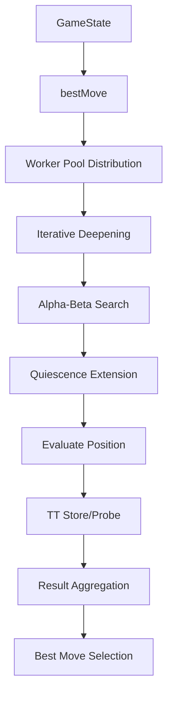

# 🧠 IA de Soluna: Análisis Técnico Profundo

## 📋 Tabla de Contenidos

1. [Arquitectura General](#arquitectura-general)
2. [Motor de Búsqueda Alpha-Beta](#motor-de-búsqueda-alpha-beta)
3. [Función de Evaluación de Fusión](#función-de-evaluación-de-fusión)
4. [Quiescence Search Extendido](#quiescence-search-extendido)
5. [Late Move Reductions (LMR)](#late-move-reductions-lmr)
6. [Worker Pool y Paralelización](#worker-pool-y-paralelización)
7. [Control de Tiempo Adaptativo](#control-de-tiempo-adaptativo)
8. [Sistema de Presets](#sistema-de-presets)
9. [Optimizaciones de Poda](#optimizaciones-de-poda)
10. [Integración con React](#integración-con-react)

---

## 🏗️ Arquitectura General

### **Estructura Modular**
```
src/ia/
├── search/
│   ├── index.ts              # Punto de entrada público
│   ├── root.ts               # Búsqueda iterativa y control
│   ├── alphabeta.ts          # Motor alpha-beta principal
│   ├── moveOrdering.ts       # Ordenación de movimientos
│   ├── tactics.ts            # Detección de movimientos tácticos
│   ├── quiescence.ts         # Búsqueda quiescence
│   └── types.ts              # Tipos del motor de búsqueda
├── worker/
│   ├── aiWorker.ts           # Worker individual
│   └── pool.ts               # Gestión de worker pool
├── evaluate.ts               # Función de evaluación
├── moves.ts                  # Generación de movimientos
├── hash.ts                   # Zobrist hashing
├── tt.ts                     # Transposition table
├── time.ts                   # Control de tiempo
└── options.ts                # Configuración por defecto
```

### **Flujo de Procesamiento Principal**


---

## 🔍 Motor de Búsqueda Alpha-Beta

### **Implementación Principal**

El motor está implementado en `search/alphabeta.ts` con soporte completo para optimizaciones avanzadas:

```typescript
export function alphaBeta(
  ctx: SearchContext,
  state: GameState,
  depth: number,
  alpha: number,
  beta: number,
  ply: number = 0
): SearchResult {
  // Time control
  if (ctx.shouldStop()) return { score: evaluate(state, ctx.player), pv: [] };
  ctx.stats.nodes++;
  
  // Terminal check
  const terminal = checkTerminal(state);
  if (terminal !== null) {
    return { score: terminal * 10000, pv: [] };
  }
  
  // Quiescence extension at depth 0
  if (depth === 0 && ctx.opts.enableQuiescence) {
    return quiescence(ctx, state, alpha, beta, ply);
  }
  
  // TT probe
  const ttHit = ctx.opts.enableTT ? ctx.tt.probe(state) : null;
  if (ttHit && ttHit.depth >= depth) {
    return adaptTTResult(ttHit, alpha, beta);
  }
  
  // Move generation and ordering
  const moves = generateMoves(state);
  const orderedMoves = orderMoves(ctx, moves, ply);
  
  let bestScore = -Infinity;
  let bestPV: Move[] = [];
  
  for (const move of orderedMoves) {
    const child = applyMove(state, move);
    
    // LMR decision
    const doLMR = shouldApplyLMR(ctx, depth, ply, move);
    const reduction = doLMR ? calculateReduction(ctx, depth, ply) : 0;
    
    const childResult = alphaBeta(
      ctx,
      child,
      depth - 1 - reduction,
      -beta,
      -alpha,
      ply + 1
    );
    
    const score = -childResult.score;
    
    // LMR re-search if needed
    if (doLMR && score > alpha && score < beta) {
      const fullResult = alphaBeta(
        ctx,
        child,
        depth - 1,
        -beta,
        -alpha,
        ply + 1
      );
      childResult.score = -fullResult.score;
      childResult.pv = fullResult.pv;
    }
    
    if (score > bestScore) {
      bestScore = score;
      bestPV = [move, ...childResult.pv];
    }
    
    alpha = Math.max(alpha, score);
    if (alpha >= beta) break; // Beta cutoff
  }
  
  // TT store
  if (ctx.opts.enableTT) {
    ctx.tt.store(state, depth, bestScore, bestPV[0]);
  }
  
  return { score: bestScore, pv: bestPV };
}
```

### **Características Avanzadas**

#### **1. Fail-Soft Alpha-Beta**
```typescript
function adaptTTResult(ttHit: TTHit, alpha: number, beta: number): SearchResult {
  switch (ttHit.flag) {
    case TTFlag.EXACT:
      return { score: ttHit.score, pv: [] };
    case TTFlag.LOWER:
      return ttHit.score >= beta 
        ? { score: ttHit.score, pv: [] }
        : { score: alpha, pv: [] };
    case TTFlag.UPPER:
      return ttHit.score <= alpha 
        ? { score: ttHit.score, pv: [] }
        : { score: beta, pv: [] };
  }
}
```

#### **2. Aspiration Windows**
```typescript
function searchWithAspiration(
  ctx: SearchContext,
  state: GameState,
  depth: number,
  prevScore: number
): SearchResult {
  if (!ctx.opts.enableAspiration || depth < 4) {
    return alphaBeta(ctx, state, depth, -Infinity, +Infinity);
  }
  
  const delta = ctx.opts.aspirationDelta || 20;
  let alpha = prevScore - delta;
  let beta = prevScore + delta;
  
  let result = alphaBeta(ctx, state, depth, alpha, beta);
  
  // Re-search if aspiration failed
  while (result.score <= alpha || result.score >= beta) {
    const window = (beta - alpha) * 2;
    alpha = result.score - window / 2;
    beta = result.score + window / 2;
    
    result = alphaBeta(ctx, state, depth, alpha, beta);
  }
  
  return result;
}
```

---

## 📊 Función de Evaluación de Fusión

### **Arquitectura de Evaluación Multi-Factor**

```typescript
export function evaluate(state: GameState, player: Player): number {
  const opponent = player === 'Light' ? 'Dark' : 'Light';
  
  // Terminal positions
  if (isGameOver(state)) {
    return evaluateTerminal(state, player);
  }
  
  // Main evaluation components
  const mergeAdvantage = evaluateMergeAdvantage(state, player, opponent);
  const turnAdvantage = evaluateTurnAdvantage(state, player);
  const positionalAdvantage = evaluatePositionalAdvantage(state, player, opponent);
  const futurePotential = evaluateFuturePotential(state, player, opponent);
  
  return (
    mergeAdvantage * MERGE_WEIGHT +
    turnAdvantage * TURN_WEIGHT +
    positionalAdvantage * POSITION_WEIGHT +
    futurePotential * FUTURE_WEIGHT
  );
}
```

### **Componentes Detallados**

#### **1. Merge Advantage Evaluation**
```typescript
function evaluateMergeAdvantage(state: GameState, player: Player, opponent: Player): number {
  let score = 0;
  
  // Count immediate merge opportunities
  const myMerges = countMergeablePairs(state, player);
  const oppMerges = countMergeablePairs(state, opponent);
  
  score += (myMerges - oppMerges) * IMMEDIATE_MERGE_VALUE;
  
  // Count potential merges (one move away)
  const myPotential = countPotentialMerges(state, player);
  const oppPotential = countPotentialMerges(state, opponent);
  
  score += (myPotential - oppPotential) * POTENTIAL_MERGE_VALUE;
  
  // Tower height bonuses
  const myTowerBonus = evaluateTowerHeights(state, player);
  const oppTowerBonus = evaluateTowerHeights(state, opponent);
  
  score += myTowerBonus - oppTowerBonus;
  
  return score;
}

function countMergeablePairs(state: GameState, player: Player): number {
  let count = 0;
  
  for (let row = 0; row < state.size; row++) {
    for (let col = 0; col < state.size; col++) {
      const cell = state.board[row][col];
      if (cell && cell.player === player && cell.height >= 2) {
        // Check for mergeable neighbors
        const neighbors = getNeighbors(state, row, col);
        for (const neighbor of neighbors) {
          if (neighbor && 
              neighbor.player === player && 
              neighbor.height >= 2 &&
              neighbor.type === cell.type) {
            count++;
          }
        }
      }
    }
  }
  
  return Math.floor(count / 2); // Each pair counted twice
}
```

#### **2. Turn Advantage Evaluation**
```typescript
function evaluateTurnAdvantage(state: GameState, player: Player): number {
  // Significant advantage to having the move
  if (state.currentPlayer === player) {
    return TURN_ADVANTAGE_BONUS;
  }
  
  return -TURN_ADVANTAGE_BONUS;
}
```

#### **3. Positional Advantage**
```typescript
function evaluatePositionalAdvantage(state: GameState, player: Player, opponent: Player): number {
  let score = 0;
  
  // Center control
  const myCenterControl = evaluateCenterControl(state, player);
  const oppCenterControl = evaluateCenterControl(state, opponent);
  score += (myCenterControl - oppCenterControl) * CENTER_WEIGHT;
  
  // Board coverage
  const myCoverage = evaluateBoardCoverage(state, player);
  const oppCoverage = evaluateBoardCoverage(state, opponent);
  score += (myCoverage - oppCoverage) * COVERAGE_WEIGHT;
  
  // Token distribution balance
  const myBalance = evaluateTokenBalance(state, player);
  const oppBalance = evaluateTokenBalance(state, opponent);
  score += (myBalance - oppBalance) * BALANCE_WEIGHT;
  
  return score;
}

function evaluateCenterControl(state: GameState, player: Player): number {
  let control = 0;
  const centerRow = Math.floor(state.size / 2);
  const centerCol = Math.floor(state.size / 2);
  
  // Check center and near-center positions
  for (let dr = -1; dr <= 1; dr++) {
    for (let dc = -1; dc <= 1; dc++) {
      const row = centerRow + dr;
      const col = centerCol + dc;
      
      if (isValidPosition(state, row, col)) {
        const cell = state.board[row][col];
        if (cell && cell.player === player) {
          const distance = Math.abs(dr) + Math.abs(dc);
          control += (3 - distance) * cell.height;
        }
      }
    }
  }
  
  return control;
}
```

#### **4. Future Potential**
```typescript
function evaluateFuturePotential(state: GameState, player: Player, opponent: Player): number {
  let score = 0;
  
  // Evaluate move flexibility
  const myMobility = countAvailableMoves(state, player);
  const oppMobility = countAvailableMoves(state, opponent);
  score += (myMobility - oppMobility) * MOBILITY_WEIGHT;
  
  // Evaluate endgame preparation
  const myEndgamePrep = evaluateEndgamePreparation(state, player);
  const oppEndgamePrep = evaluateEndgamePreparation(state, opponent);
  score += (myEndgamePrep - oppEndgamePrep) * ENDGAME_WEIGHT;
  
  return score;
}
```

---

## 🔍 Quiescence Search Extendido

### **Implementación Especializada para Soluna**

```typescript
export function quiescence(
  ctx: SearchContext,
  state: GameState,
  alpha: number,
  beta: number,
  ply: number
): SearchResult {
  const maxDepth = ctx.opts.quiescenceDepth || 3;
  
  // Stand-pat evaluation
  const standPat = evaluate(state, ctx.player);
  
  if (ctx.player === state.currentPlayer) {
    if (standPat >= beta) return { score: standPat, pv: [] };
    alpha = Math.max(alpha, standPat);
  } else {
    if (standPat <= alpha) return { score: standPat, pv: [] };
    beta = Math.min(beta, standPat);
  }
  
  // Depth limit check
  if (ply >= maxDepth) {
    return { score: standPat, pv: [] };
  }
  
  // Generate only tactical moves (merges and potential merges)
  const tacticalMoves = generateTacticalMoves(state);
  if (tacticalMoves.length === 0) {
    return { score: standPat, pv: [] };
  }
  
  // High tower threshold filter
  const filteredMoves = tacticalMoves.filter(move => 
    isHighTowerMove(state, move, ctx.opts.quiescenceHighTowerThreshold || 4)
  );
  
  if (filteredMoves.length === 0) {
    return { score: standPat, pv: [] };
  }
  
  // Order tactical moves
  const orderedMoves = orderTacticalMoves(filteredMoves);
  
  let bestScore = standPat;
  let bestPV: Move[] = [];
  
  for (const move of orderedMoves) {
    const child = applyMove(state, move);
    const result = quiescence(ctx, child, alpha, beta, ply + 1);
    
    if (ctx.player === state.currentPlayer) {
      if (result.score > bestScore) {
        bestScore = result.score;
        bestPV = [move, ...result.pv];
      }
      alpha = Math.max(alpha, result.score);
    } else {
      if (result.score < bestScore) {
        bestScore = result.score;
        bestPV = [move, ...result.pv];
      }
      beta = Math.min(beta, result.score);
    }
    
    if (alpha >= beta) break; // Beta cutoff
  }
  
  return { score: bestScore, pv: bestPV };
}
```

### **Detección de Movimientos Tácticos**

```typescript
function generateTacticalMoves(state: GameState): Move[] {
  const tacticalMoves: Move[] = [];
  
  for (let row = 0; row < state.size; row++) {
    for (let col = 0; col < state.size; col++) {
      const cell = state.board[row][col];
      if (!cell || cell.height === 0) continue;
      
      // Check for immediate merges
      const mergeMoves = generateMergeMoves(state, row, col);
      tacticalMoves.push(...mergeMoves);
      
      // Check for merge setup moves
      const setupMoves = generateMergeSetupMoves(state, row, col);
      tacticalMoves.push(...setupMoves);
    }
  }
  
  return tacticalMoves;
}

function isHighTowerMove(state: GameState, move: Move, threshold: number): boolean {
  if (move.type !== 'place') return false;
  
  const targetCell = state.board[move.row][move.col];
  if (!targetCell) return false;
  
  return targetCell.height >= threshold;
}
```

---

## ⚡ Late Move Reductions (LMR)

### **Implementación Avanzada**

```typescript
function shouldApplyLMR(
  ctx: SearchContext,
  depth: number,
  ply: number,
  move: Move
): boolean {
  // Basic LMR conditions
  if (depth < (ctx.opts.lmrMinDepth || 3)) return false;
  if (ply < (ctx.opts.lmrLateMoveIdx || 4)) return false;
  if (!ctx.opts.enableLMR) return false;
  
  // Don't reduce tactical moves
  if (isTacticalMove(move)) return false;
  
  // Don't reduce in check-like positions (important merges available)
  if (hasCriticalMerge(state, move)) return false;
  
  return true;
}

function calculateReduction(
  ctx: SearchContext,
  depth: number,
  ply: number
): number {
  let reduction = (ctx.opts.lmrReduction || 1);
  
  // Deeper searches allow more reduction
  if (depth > 6) reduction += 1;
  
  // Later moves get more reduction
  if (ply > 8) reduction += 1;
  
  return Math.min(reduction, depth - 1); // Don't reduce to 0 or negative
}

function isTacticalMove(move: Move): boolean {
  return move.type === 'merge' || 
         (move.type === 'place' && createsMergeOpportunity(move));
}

function hasCriticalMerge(state: GameState, move: Move): boolean {
  // Check if position has immediate merge opportunities
  const criticalMerges = findCriticalMerges(state);
  return criticalMerges.length > 0;
}
```

### **LMR con Re-search**

```typescript
// In the main alpha-beta loop
for (const move of orderedMoves) {
  const child = applyMove(state, move);
  
  const doLMR = shouldApplyLMR(ctx, depth, ply, move);
  const reduction = doLMR ? calculateReduction(ctx, depth, ply) : 0;
  
  let childResult: SearchResult;
  
  if (doLMR) {
    // Reduced depth search
    childResult = alphaBeta(
      ctx,
      child,
      depth - 1 - reduction,
      -beta,
      -alpha,
      ply + 1
    );
    
    // Re-search if LMR failed and move is promising
    if (childResult.score > alpha && childResult.score < beta) {
      childResult = alphaBeta(
        ctx,
        child,
        depth - 1,
        -beta,
        -alpha,
        ply + 1
      );
    }
  } else {
    // Full depth search
    childResult = alphaBeta(
      ctx,
      child,
      depth - 1,
      -beta,
      -alpha,
      ply + 1
    );
  }
  
  const score = -childResult.score;
  
  if (score > bestScore) {
    bestScore = score;
    bestPV = [move, ...childResult.pv];
  }
  
  alpha = Math.max(alpha, score);
  if (alpha >= beta) break;
}
```

---

## 🔄 Worker Pool y Paralelización

### **Arquitectura del Worker Pool**

```typescript
export class WorkerPool {
  private workers: Worker[] = [];
  private availableWorkers: Worker[] = [];
  private busyWorkers: Set<Worker> = new Set();
  private taskQueue: SearchTask[] = [];
  private workerCount: number;
  
  constructor(workerCount: number = navigator.hardwareConcurrency || 4) {
    this.workerCount = workerCount;
    this.initializeWorkers();
  }
  
  private initializeWorkers(): void {
    for (let i = 0; i < this.workerCount; i++) {
      const worker = new Worker('/src/ia/worker/aiWorker.ts');
      worker.onmessage = this.handleWorkerMessage.bind(this);
      this.workers.push(worker);
      this.availableWorkers.push(worker);
    }
  }
  
  async search(
    state: GameState,
    options: SearchOptions
  ): Promise<SearchResult> {
    // Decide between root parallel and single worker
    if (options.enableRootParallel && this.shouldUseRootParallel(state, options)) {
      return this.rootParallelSearch(state, options);
    } else {
      return this.singleWorkerSearch(state, options);
    }
  }
  
  private async rootParallelSearch(
    state: GameState,
    options: SearchOptions
  ): Promise<SearchResult> {
    const moves = generateMoves(state);
    const movesPerWorker = Math.ceil(moves.length / this.workerCount);
    
    const promises = moves.map((move, index) => {
      const workerIndex = Math.floor(index / movesPerWorker);
      const worker = this.workers[workerIndex];
      
      return this.searchWithWorker(worker, state, {
        ...options,
        rootMoves: [move]
      });
    });
    
    const results = await Promise.all(promises);
    return this.selectBestResult(results);
  }
  
  private async singleWorkerSearch(
    state: GameState,
    options: SearchOptions
  ): Promise<SearchResult> {
    const worker = await this.getAvailableWorker();
    
    try {
      return await this.searchWithWorker(worker, state, options);
    } finally {
      this.releaseWorker(worker);
    }
  }
  
  private async searchWithWorker(
    worker: Worker,
    state: GameState,
    options: SearchOptions
  ): Promise<SearchResult> {
    return new Promise((resolve, reject) => {
      const taskId = this.generateTaskId();
      
      const timeout = setTimeout(() => {
        reject(new Error('Worker search timeout'));
      }, options.timeLimit + 1000);
      
      const handleMessage = (event: MessageEvent) => {
        const { type, payload } = event.data;
        
        if (type === 'result' && payload.taskId === taskId) {
          clearTimeout(timeout);
          worker.removeEventListener('message', handleMessage);
          resolve(payload.result);
        } else if (type === 'error' && payload.taskId === taskId) {
          clearTimeout(timeout);
          worker.removeEventListener('message', handleMessage);
          reject(new Error(payload.error));
        }
      };
      
      worker.addEventListener('message', handleMessage);
      worker.postMessage({
        type: 'search',
        payload: {
          taskId,
          state,
          options
        }
      });
    });
  }
  
  private async getAvailableWorker(): Promise<Worker> {
    if (this.availableWorkers.length > 0) {
      return this.availableWorkers.pop()!;
    }
    
    // Wait for a worker to become available
    return new Promise((resolve) => {
      const checkInterval = setInterval(() => {
        if (this.availableWorkers.length > 0) {
          clearInterval(checkInterval);
          resolve(this.availableWorkers.pop()!);
        }
      }, 10);
    });
  }
  
  private releaseWorker(worker: Worker): void {
    this.busyWorkers.delete(worker);
    this.availableWorkers.push(worker);
  }
  
  private shouldUseRootParallel(state: GameState, options: SearchOptions): boolean {
    // Use root parallel for deep searches with many root moves
    const moveCount = generateMoves(state).length;
    return options.maxDepth >= 6 && moveCount >= this.workerCount * 2;
  }
}
```

### **Implementación del Worker Individual**

```typescript
// aiWorker.ts
self.onmessage = function(event) {
  const { type, payload } = event.data;
  
  switch (type) {
    case 'search':
      handleSearch(payload);
      break;
    case 'stop':
      handleStop();
      break;
  }
};

function handleSearch(payload: SearchRequest): void {
  const { taskId, state, options } = payload;
  
  try {
    const result = bestMove(state, options);
    
    self.postMessage({
      type: 'result',
      payload: {
        taskId,
        result: {
          ...result,
          workerId: getWorkerId()
        }
      }
    });
  } catch (error) {
    self.postMessage({
      type: 'error',
      payload: {
        taskId,
        error: error.message
      }
    });
  }
}

function bestMove(state: GameState, options: SearchOptions): SearchResult {
  const startTime = performance.now();
  const ctx: SearchContext = {
    player: state.currentPlayer,
    opts: options,
    stats: { nodes: 0 },
    shouldStop: () => performance.now() - startTime > options.timeLimit,
    tt: new TranspositionTable(options.ttSize || 32768)
  };
  
  return iterativeDeepening(ctx, state, options.maxDepth);
}
```

---

## ⏱️ Control de Tiempo Adaptativo

### **Sistema de Tiempo Multi-Nivel**

```typescript
interface AdaptiveTimeConfig {
  minMs: number;
  maxMs: number;
  baseMs: number;
  perMoveMs: number;
  exponent: number;
}

export class AdaptiveTimeManager {
  private config: AdaptiveTimeConfig;
  private moveHistory: number[] = [];
  
  constructor(config: AdaptiveTimeConfig) {
    this.config = config;
  }
  
  allocateTime(state: GameState, moveNumber: number): number {
    const complexity = calculateComplexity(state);
    const timePressure = calculateTimePressure();
    
    let allocatedTime = this.config.baseMs;
    
    // Adjust for move number (exponential growth)
    const moveFactor = Math.pow(this.config.exponent, moveNumber / 20);
    allocatedTime += this.config.perMoveMs * moveFactor;
    
    // Adjust for position complexity
    allocatedTime *= (1 + complexity * 0.5);
    
    // Adjust for time pressure
    allocatedTime *= timePressure;
    
    // Clamp to min/max bounds
    allocatedTime = Math.max(this.config.minMs, allocatedTime);
    allocatedTime = Math.min(this.config.maxMs, allocatedTime);
    
    return allocatedTime;
  }
  
  updateMoveHistory(actualTime: number): void {
    this.moveHistory.push(actualTime);
    if (this.moveHistory.length > 10) {
      this.moveHistory.shift();
    }
  }
  
  getAverageMoveTime(): number {
    if (this.moveHistory.length === 0) return 0;
    return this.moveHistory.reduce((a, b) => a + b, 0) / this.moveHistory.length;
  }
}

function calculateComplexity(state: GameState): number {
  let complexity = 0;
  
  // Merge opportunities increase complexity
  const mergeCount = countMergeablePairs(state, state.currentPlayer);
  complexity += mergeCount * 0.1;
  
  // Tower height variation increases complexity
  const heightVariance = calculateHeightVariance(state);
  complexity += heightVariance * 0.05;
  
  // Board occupation increases complexity
  const occupation = calculateBoardOccupation(state);
  complexity += occupation * 0.1;
  
  return Math.min(complexity, 1.0);
}

function calculateTimePressure(): number {
  // Simple time pressure based on remaining time
  // In a real implementation, this would consider actual game clock
  return 1.0;
}
```

---

## 🎛️ Sistema de Presets

### **Arquitectura de Presets**

```typescript
export interface IAPreset {
  id: string;
  name: string;
  settings: SearchOptions;
}

export class PresetManager {
  private presets: Map<string, IAPreset> = new Map();
  private selectedPresetId: string | null = null;
  
  constructor() {
    this.loadDefaultPresets();
    this.loadUserPresets();
  }
  
  private loadDefaultPresets(): void {
    const defaultPresets: IAPreset[] = [
      {
        id: 'iapowa',
        name: 'IAPowa',
        settings: {
          enableTT: true,
          enablePVS: true,
          enableKillers: true,
          enableHistory: true,
          enableLMR: true,
          enableQuiescence: true,
          quiescenceDepth: 3,
          aspirationEnabled: false,
          timeMode: 'auto',
          difficulty: 10
        }
      },
      {
        id: 'iapowa_performance',
        name: 'IAPowa+Rendimiento',
        settings: {
          enableTT: true,
          enablePVS: true,
          enableKillers: true,
          enableHistory: true,
          enableLMR: true,
          enableQuiescence: true,
          quiescenceDepth: 2,
          aspirationEnabled: true,
          aspirationDelta: 25,
          enableFutility: true,
          futilityMargin: 30,
          enableLMP: true,
          timeMode: 'manual',
          timeSeconds: 5,
          difficulty: 4
        }
      },
      {
        id: 'iapowa_defense',
        name: 'IAPowa+Defensa',
        settings: {
          enableTT: true,
          enablePVS: true,
          enableKillers: true,
          enableHistory: true,
          enableLMR: true,
          enableQuiescence: true,
          quiescenceDepth: 4,
          aspirationEnabled: false,
          enableFutility: false,
          enableLMP: false,
          enableNullMove: false,
          timeMode: 'manual',
          timeSeconds: 30,
          difficulty: 5
        }
      }
    ];
    
    for (const preset of defaultPresets) {
      this.presets.set(preset.id, preset);
    }
  }
  
  getPreset(id: string): IAPreset | null {
    return this.presets.get(id) || null;
  }
  
  getAllPresets(): IAPreset[] {
    return Array.from(this.presets.values());
  }
  
  selectPreset(id: string): void {
    if (this.presets.has(id)) {
      this.selectedPresetId = id;
      this.saveSelectedPreset();
    }
  }
  
  getSelectedPreset(): IAPreset | null {
    if (this.selectedPresetId) {
      return this.getPreset(this.selectedPresetId);
    }
    return null;
  }
  
  createCustomPreset(name: string, settings: SearchOptions): IAPreset {
    const id = `custom_${Date.now()}`;
    const preset: IAPreset = { id, name, settings };
    
    this.presets.set(id, preset);
    this.saveUserPresets();
    
    return preset;
  }
  
  updatePreset(id: string, settings: Partial<SearchOptions>): boolean {
    const preset = this.presets.get(id);
    if (!preset) return false;
    
    preset.settings = { ...preset.settings, ...settings };
    this.saveUserPresets();
    
    return true;
  }
  
  deletePreset(id: string): boolean {
    if (!this.presets.has(id)) return false;
    
    this.presets.delete(id);
    this.saveUserPresets();
    
    if (this.selectedPresetId === id) {
      this.selectedPresetId = null;
      this.saveSelectedPreset();
    }
    
    return true;
  }
  
  private loadUserPresets(): void {
    try {
      const saved = localStorage.getItem('soluna:ia:presets');
      if (saved) {
        const userPresets: IAPreset[] = JSON.parse(saved);
        for (const preset of userPresets) {
          this.presets.set(preset.id, preset);
        }
      }
    } catch (error) {
      console.warn('Failed to load user presets:', error);
    }
  }
  
  private saveUserPresets(): void {
    try {
      const userPresets = Array.from(this.presets.values())
        .filter(p => p.id.startsWith('custom_'));
      localStorage.setItem('soluna:ia:presets', JSON.stringify(userPresets));
    } catch (error) {
      console.warn('Failed to save user presets:', error);
    }
  }
  
  private saveSelectedPreset(): void {
    try {
      if (this.selectedPresetId) {
        localStorage.setItem('soluna:ia:selected', this.selectedPresetId);
      } else {
        localStorage.removeItem('soluna:ia:selected');
      }
    } catch (error) {
      console.warn('Failed to save selected preset:', error);
    }
  }
}
```

---

## 🚫 Optimizaciones de Poda

### **Futility Pruning**

```typescript
function shouldApplyFutility(
  ctx: SearchContext,
  state: GameState,
  depth: number,
  alpha: number,
  beta: number
): boolean {
  if (!ctx.opts.enableFutility) return false;
  if (depth > 3) return false;  // Only apply at shallow depths
  
  const staticEval = evaluate(state, ctx.player);
  const margin = ctx.opts.futilityMargin || 10;
  
  // If even the best possible improvement can't reach alpha
  if (ctx.player === state.currentPlayer) {
    return staticEval + margin < alpha;
  } else {
    return staticEval - margin > beta;
  }
}
```

### **Late Move Pruning (LMP)**

```typescript
function shouldPruneLateMove(
  ctx: SearchContext,
  depth: number,
  moveIndex: number,
  totalMoves: number
): boolean {
  if (!ctx.opts.enableLMP) return false;
  if (depth > (ctx.opts.lmpMaxDepth || 2)) return false;
  if (moveIndex < (ctx.opts.lmpBase || 6)) return false;
  
  // Prune a percentage of late moves based on depth
  const pruneRatio = Math.max(0.3, 1 - (depth / 3));
  const lateMoveThreshold = totalMoves * (1 - pruneRatio);
  
  return moveIndex >= lateMoveThreshold;
}
```

### **Null-Move Pruning**

```typescript
function shouldApplyNullMove(
  ctx: SearchContext,
  state: GameState,
  depth: number
): boolean {
  if (!ctx.opts.enableNullMove) return false;
  if (depth < (ctx.opts.nullMoveMinDepth || 3)) return false;
  
  // Avoid null-move in positions with immediate merges
  const criticalMerges = findCriticalMerges(state);
  if (criticalMerges.length > 0) return false;
  
  return true;
}

function nullMoveSearch(
  ctx: SearchContext,
  state: GameState,
  depth: number,
  beta: number
): number {
  // Make a null move (pass turn)
  const nullState = { ...state, currentPlayer: getOpponent(state.currentPlayer) };
  
  const reduction = ctx.opts.nullMoveReduction || 2;
  const result = alphaBeta(ctx, nullState, depth - 1 - reduction, beta - 1, beta);
  
  return -result.score;
}
```

---

## ⚛️ Integración con React

### **Hooks de IA**

```typescript
// hooks/useAIController.ts
export function useAIController() {
  const [isSearching, setIsSearching] = useState(false);
  const [lastResult, setLastResult] = useState<SearchResult | null>(null);
  const [stats, setStats] = useState<SearchStats>({ nodes: 0, elapsedMs: 0 });
  
  const workerPool = useRef<WorkerPool>();
  const presetManager = useRef<PresetManager>();
  
  useEffect(() => {
    workerPool.current = new WorkerPool();
    presetManager.current = new PresetManager();
    
    return () => {
      workerPool.current?.terminate();
    };
  }, []);
  
  const findBestMove = useCallback(async (
    state: GameState,
    options: SearchOptions
  ): Promise<SearchResult> => {
    if (!workerPool.current) throw new Error('Worker pool not initialized');
    
    setIsSearching(true);
    setStats({ nodes: 0, elapsedMs: 0 });
    
    try {
      const result = await workerPool.current.search(state, options);
      setLastResult(result);
      setStats(result.stats || { nodes: 0, elapsedMs: 0 });
      return result;
    } finally {
      setIsSearching(false);
    }
  }, []);
  
  const stopSearch = useCallback(() => {
    workerPool.current?.stop();
    setIsSearching(false);
  }, []);
  
  const applyPreset = useCallback((presetId: string) => {
    const preset = presetManager.current?.getPreset(presetId);
    if (preset) {
      presetManager.current?.selectPreset(presetId);
      return preset.settings;
    }
    return null;
  }, []);
  
  return {
    isSearching,
    lastResult,
    stats,
    findBestMove,
    stopSearch,
    applyPreset,
    presets: presetManager.current?.getAllPresets() || [],
    selectedPreset: presetManager.current?.getSelectedPreset() || null
  };
}
```

### **Componente de Panel de IA**

```typescript
// components/IAPanel/IAPanel.tsx
export function IAPanel() {
  const {
    isSearching,
    lastResult,
    stats,
    findBestMove,
    stopSearch,
    applyPreset,
    presets,
    selectedPreset
  } = useAIController();
  
  const [localOptions, setLocalOptions] = useState<SearchOptions>({
    maxDepth: 10,
    timeLimitMs: 10000,
    enableTT: true,
    enablePVS: true,
    enableLMR: true,
    enableQuiescence: true
  });
  
  const handleSearch = useCallback(async () => {
    const gameState = getCurrentGameState();
    const options = selectedPreset?.settings || localOptions;
    
    await findBestMove(gameState, options);
  }, [findBestMove, selectedPreset, localOptions]);
  
  return (
    <div className="ia-panel">
      <div className="ia-controls">
        <PresetSelector
          presets={presets}
          selectedPreset={selectedPreset}
          onPresetChange={applyPreset}
        />
        
        <SearchControls
          options={localOptions}
          onOptionsChange={setLocalOptions}
          disabled={isSearching}
        />
        
        <SearchButton
          isSearching={isSearching}
          onSearch={handleSearch}
          onStop={stopSearch}
        />
      </div>
      
      <SearchStats stats={stats} />
      
      {lastResult && (
        <SearchResult result={lastResult} />
      )}
    </div>
  );
}
```

---

## 📈 Métricas y Performance

### **Estadísticas Detalladas**

```typescript
interface DetailedSearchStats extends SearchStats {
  ttHitRate: number;
  cutoffRate: number;
  qNodeRate: number;
  lmrRate: number;
  avgBranchingFactor: number;
  effectiveBranchingFactor: number;
  nodesPerSecond: number;
  depthReached: number;
  pv: Move[];
}

export function calculateDetailedStats(
  baseStats: SearchStats,
  searchInfo: SearchInfo
): DetailedSearchStats {
  return {
    ...baseStats,
    ttHitRate: baseStats.ttReads > 0 ? baseStats.ttHits / baseStats.ttReads : 0,
    cutoffRate: baseStats.nodes > 0 ? searchInfo.cutoffs / baseStats.nodes : 0,
    qNodeRate: baseStats.nodes > 0 ? searchInfo.qNodes / baseStats.nodes : 0,
    lmrRate: baseStats.nodes > 0 ? searchInfo.lmrNodes / baseStats.nodes : 0,
    avgBranchingFactor: calculateAvgBranchingFactor(searchInfo),
    effectiveBranchingFactor: calculateEffectiveBranchingFactor(searchInfo),
    nodesPerSecond: baseStats.elapsedMs > 0 ? (baseStats.nodes * 1000) / baseStats.elapsedMs : 0,
    depthReached: searchInfo.maxDepthReached,
    pv: searchInfo.pv || []
  };
}
```

---

## 🔮 Extensiones Futuras

### **Mejoras Planificadas**

1. **Neural Network Evaluation**
   - Reemplazar heurísticas hand-tuned con red neuronal
   - Entrenamiento con auto-play y reinforcement learning

2. **Monte Carlo Tree Search Integration**
   - Complementar alpha-beta con MCTS para ciertas fases
   - Hybrid search para posiciones complejas

3. **Dynamic Pruning**
   - Ajuste automático de umbrales de poda basado en posición
   - Learning de patrones de poda efectivas

4. **Opening Book Learning**
   - Actualización automática del libro de aperturas
   - Adaptación al estilo del oponente

---

## 📝 Conclusión

La IA de Soluna representa una implementación **completa y moderna** de **alpha-beta con múltiples optimizaciones** específicas para juegos de fusión. Las características clave incluyen:

- **Evaluación multi-factor** especializada en oportunidades de fusión
- **Quiescence search** extendido para movimientos tácticos
- **Worker pool** para paralelización efectiva
- **Control de tiempo adaptativo** basado en complejidad
- **Sistema de presets** configurable y persistente
- **Optimizaciones de poda** avanzadas (LMR, Futility, LMP)
- **Integración completa** con React y hooks modernos

El sistema está diseñado para ser **altamente configurable** y **extensible**, permitiendo experimentación con diferentes combinaciones de optimizaciones sin recompilación. La arquitectura modular facilita la adición de nuevas características y el mantenimiento del código a largo plazo.
