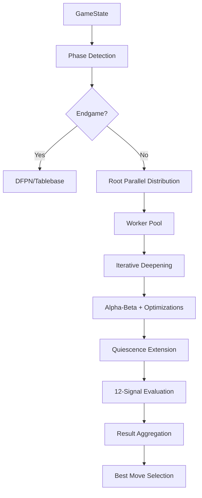

# 🧠 IA de Squadro: Análisis Técnico Profundo

## 📋 Tabla de Contenidos

1. [Arquitectura General](#arquitectura-general)
2. [Motor de Búsqueda Paralelo](#motor-de-búsqueda-paralelo)
3. [Sistema de Evaluación de 12 Señales](#sistema-de-evaluación-de-12-señales)
4. [Root Parallel y 2nd-Ply Split](#root-parallel-y-2nd-ply-split)
5. [DFPN Proof-Number Search](#dfpn-proof-number-search)
6. [Tablebase y Endgame Solver](#tablebase-y-endgame-solver)
7. [Control de Tiempo Adaptativo](#control-de-tiempo-adaptativo)
8. [Sistema de Presets Completo](#sistema-de-presets-completo)
9. [Worker Pool Avanzado](#worker-pool-avanzado)
10. [Integración con Redux](#integración-con-redux)

---

## 🏗️ Arquitectura General

### **Estructura Modular Compleja**
```
src/ia/
├── search/
│   ├── index.ts              # Motor de búsqueda principal
│   ├── iterative.ts          # Búsqueda iterativa
│   ├── parallel/
│   │   ├── rootParallel.ts   # Paralelización en raíz
│   │   └── secondPlySplit.ts # División en 2nd ply
│   ├── dfpn/
│   │   └── dfpn.ts           # Proof-Number Search
│   ├── alphabeta.ts          # Alpha-Beta con optimizaciones
│   ├── moveOrdering.ts       # Ordenación avanzada
│   ├── quiescence.ts         # Búsqueda quiescence extendida
│   └── types.ts              # Tipos del motor
├── evaluate.ts               # Sistema de 12 señales
├── evalTypes.ts              # Tipos de evaluación
├── evalPresets.ts            # Presets de evaluación
├── moves.ts                  # Generación de movimientos
├── tablebase/
│   └── index.ts              # Endgame tablebase
├── workers/
│   ├── pool.ts               # Worker pool manager
│   └── coordinator.ts        # Coordinación de workers
├── presets.ts                # Presets de IA
└── types.ts                  # Tipos generales
```

### **Flujo de Procesamiento Paralelo**


---

## 🔍 Motor de Búsqueda Paralelo

### **Implementación Principal**

```typescript
export async function findBestMove(
  rootState: GameState,
  opts: SearchOptions
): Promise<BestMove> {
  const stats = { nodes: 0 };
  const allowed = opts.rootMoves ? new Set(opts.rootMoves) : undefined;
  
  // Phase detection and adaptive configuration
  const phase = detectPhase(rootState);
  const engineConfig = adaptEngineConfig(opts.engine, phase);
  
  // Fast-path: Tablebase for endgames
  if (engineConfig.enableTablebase) {
    const tbHit = tableProbe(rootState);
    if (tbHit) {
      return handleTablebaseHit(tbHit, opts);
    }
  }
  
  // Fast-path: DFPN for tiny endgames
  const activeCount = countActivePieces(rootState);
  if (engineConfig.enableDFPN && activeCount <= (engineConfig.dfpnMaxActive || 2)) {
    const dfpnResult = dfpnProbe(rootState, engineConfig);
    if (dfpnResult.solved) {
      return handleDFPNResult(dfpnResult, opts);
    }
  }
  
  // Main search: choose parallelization strategy
  if (engineConfig.useWorkers && shouldUseRootParallel(rootState, opts)) {
    return await findBestMoveRootParallel(rootState, {
      ...opts,
      engine: engineConfig
    });
  } else {
    return await bestMoveIterative(rootState, {
      ...opts,
      engine: engineConfig
    });
  }
}
```

### **Búsqueda Iterativa con Progresión**

```typescript
async function bestMoveIterative(
  rootState: GameState,
  opts: SearchOptions
): Promise<BestMove> {
  const startTime = performance.now();
  const shouldStop = () => performance.now() - startTime >= opts.timeLimitMs;
  
  let bestResult: SearchResult = {
    score: 0,
    depth: 0,
    bestMove: null,
    pv: [],
    nodes: 0
  };
  
  // Adaptive time management
  const timeManager = new AdaptiveTimeManager(opts.engine);
  
  for (let depth = 1; depth <= opts.maxDepth && !shouldStop(); depth++) {
    const timeBudget = timeManager.allocateTime(depth, startTime);
    
    const depthResult = await searchDepth(rootState, depth, {
      ...opts,
      timeLimitMs: timeBudget,
      shouldStop
    });
    
    if (depthResult.bestMove && !shouldStop()) {
      bestResult = depthResult;
      
      opts.onProgress?.({
        type: 'iter',
        depth,
        score: depthResult.score,
        bestMove: depthResult.bestMove,
        pv: depthResult.pv
      });
    }
    
    // Early termination if clearly winning/losing
    if (Math.abs(depthResult.score) > 50000) {
      break;
    }
  }
  
  return {
    moveId: bestResult.bestMove,
    score: bestResult.score,
    depthReached: bestResult.depth,
    engineStats: bestResult.stats
  };
}
```

---

## 📊 Sistema de Evaluación de 12 Señales

### **Arquitectura Multi-Signal**

```typescript
export interface Features12 {
  race: number;        // 100 * (oppTop4 - myTop4)
  done: number;        // (ownDone - oppDone) * done_bonus
  clash: number;       // 50 * (oppLoss - myLoss) immediate
  chain: number;       // 15 * extra send-backs in chain
  sprint: number;      // Sprint term (already in points)
  block: number;       // Block quality term
  parity: number;      // 12 * crossings won
  struct: number;      // 10 * choked lines
  ones: number;        // +30/-30 for safe/vulnerable ones
  ret: number;         // +5/-5 return efficiency
  waste: number;       // 8 * (myWaste - oppWaste)
  mob: number;         // 6 * (myMobility - oppMobility)
}

export function evaluate(gs: GameState, root: Player): number {
  const me = root;
  
  // Terminal handling with mate scores
  if (gs.winner) {
    return gs.winner === me ? 100000 : -100000;
  }
  
  // Get evaluation parameters (allow runtime overrides)
  const params = getEvalParams(gs, me);
  
  // Compute all 12 features
  const features = computeFeatures(gs, me, params.sprint_threshold);
  
  // Weighted linear combination
  return (
    params.w_race * features.race +
    params.done_bonus * features.done +
    params.w_clash * features.clash +
    (params.w_chain ?? 1) * features.chain +
    params.w_sprint * features.sprint +
    params.w_block * features.block +
    (params.w_parity ?? 1) * features.parity +
    (params.w_struct ?? 1) * features.struct +
    (params.w_ones ?? 1) * features.ones +
    (params.w_return ?? 1) * features.ret +
    (params.w_waste ?? 1) * features.waste +
    (params.w_mob ?? 1) * features.mob
  );
}
```

### **Computación Detallada de Señales**

#### **1. Race Signal (Carrera)**
```typescript
function top4TurnsNoInteraction(gs: GameState, side: Player): number {
  const times: number[] = [];
  
  for (const piece of gs.pieces) {
    if (piece.owner !== side || piece.state === 'retirada') continue;
    
    const lane = gs.lanesByPlayer[side][piece.laneIndex];
    const estimatedTurns = estimateTurnsLeftNoInter(gs, piece, lane);
    times.push(estimatedTurns);
  }
  
  times.sort((a, b) => a - b);
  
  // Sum of fastest 4 pieces
  let total = 0;
  for (let i = 0; i < Math.min(4, times.length); i++) {
    total += times[i];
  }
  
  return total;
}

function estimateTurnsLeftNoInter(gs: GameState, piece: Piece, lane: Lane): number {
  if (piece.state === 'retirada') return 0;
  
  let turns = 0;
  
  if (piece.state === 'en_ida') {
    // Outbound journey
    const distOut = Math.max(0, lane.length - piece.pos);
    const speedOut = Math.max(1, lane.speedOut);
    turns += Math.ceil(distOut / speedOut);
    
    // Return journey
    const speedBack = Math.max(1, lane.speedBack);
    turns += Math.ceil(lane.length / speedBack);
  } else if (piece.state === 'en_vuelta') {
    // Return journey remaining
    const distBack = piece.pos;
    const speedBack = Math.max(1, lane.speedBack);
    turns += Math.ceil(distBack / speedBack);
  }
  
  return turns;
}
```

#### **2. Clash Signal (Colisiones Inmediatas)**
```typescript
function immediateClashDelta(gs: GameState): number {
  const current = gs.current;
  const opponent = current === 'Light' ? 'Dark' : 'Light';
  
  let myLosses = 0;
  let oppLosses = 0;
  
  // Check each piece for immediate collision opportunities
  for (const piece of gs.pieces) {
    if (piece.owner === current && piece.state === 'en_ida') {
      const sendBackCount = approxOppSendBackCount(gs, piece);
      myLosses += sendBackCount;
    } else if (piece.owner === opponent && piece.state === 'en_ida') {
      const sendBackCount = approxOppSendBackCount(gs, piece);
      oppLosses += sendBackCount;
    }
  }
  
  return oppLosses - myLosses;
}

function approxOppSendBackCount(gs: GameState, piece: Piece): number {
  // Approximate how many opponents could send this piece back
  let count = 0;
  const opponent = piece.owner === 'Light' ? 'Dark' : 'Light';
  
  for (const oppPiece of gs.pieces) {
    if (oppPiece.owner !== opponent || oppPiece.state !== 'en_ida') continue;
    
    // Check if opponent piece can reach collision position
    if (canReachCollisionPosition(gs, oppPiece, piece)) {
      count++;
    }
  }
  
  return count;
}
```

#### **3. Chain Signal (Cadenas de Send-Back)**
```typescript
function bestMyChain(gs: GameState, me: Player): number {
  if (gs.turn !== me) return 0;
  
  const opponent = me === 'Light' ? 'Dark' : 'Light';
  let bestChain = 0;
  
  for (const move of generateMoves(gs)) {
    const child = applyMove(gs, move);
    const sendBackCount = sendBackCountLocal(gs, child, opponent);
    
    if (sendBackCount > bestChain) {
      bestChain = sendBackCount;
    }
    
    if (bestChain >= 3) break; // Reasonable cap
  }
  
  // 15 points per extra piece in chain (beyond the first)
  return 15 * Math.max(0, bestChain - 1);
}

function sendBackCountLocal(gs: GameState, child: GameState, opponent: Player): number {
  let count = 0;
  
  for (const piece of child.pieces) {
    if (piece.owner === opponent && piece.state === 'envuelto') {
      count++;
    }
  }
  
  return count;
}
```

#### **4. Sprint Signal (Velocidad de Carrera)**
```typescript
function sprintTerm(gs: GameState, me: Player, opp: Player, threshold: number): number {
  let score = 0;
  
  // Check my pieces for sprint opportunities
  for (const piece of gs.pieces) {
    if (piece.owner !== me || piece.state !== 'en_ida') continue;
    
    const lane = gs.lanesByPlayer[me][piece.laneIndex];
    const turnsToFinish = estimateTurnsLeftNoInter(gs, piece, lane);
    
    if (turnsToFinish <= threshold) {
      score += 10; // Sprint bonus
    }
  }
  
  // Check opponent pieces for defensive needs
  for (const piece of gs.pieces) {
    if (piece.owner !== opp || piece.state !== 'en_ida') continue;
    
    const lane = gs.lanesByPlayer[opp][piece.laneIndex];
    const turnsToFinish = estimateTurnsLeftNoInter(gs, piece, lane);
    
    if (turnsToFinish <= threshold) {
      score -= 5; // Defensive penalty
    }
  }
  
  return score;
}
```

---

## 🔄 Root Parallel y 2nd-Ply Split

### **Root Parallel Implementation**

```typescript
export async function findBestMoveRootParallel(
  rootState: GameState,
  opts: SearchOptions
): Promise<BestMove> {
  const moves = generateMoves(rootState);
  const workerCount = opts.workerCount || navigator.hardwareConcurrency || 4;
  
  // Distribute moves among workers
  const moveDistribution = distributeMoves(moves, workerCount);
  
  // Create search tasks for each worker
  const tasks = moveDistribution.map((moveSet, index) => ({
    workerId: index,
    rootState,
    moves: moveSet,
    options: {
      ...opts,
      rootMoves: moveSet.map(m => m.id)
    }
  }));
  
  // Execute in parallel
  const promises = tasks.map(task => executeSearchTask(task));
  const results = await Promise.all(promises);
  
  // Aggregate results
  return aggregateResults(results);
}

function distributeMoves(moves: Move[], workerCount: number): Move[][] {
  const distribution: Move[][] = Array(workerCount).fill(null).map(() => []);
  
  // Sort moves by static evaluation for better load balancing
  const sortedMoves = moves.sort((a, b) => {
    const scoreA = evaluateMoveStatic(a);
    const scoreB = evaluateMoveStatic(b);
    return scoreB - scoreA;
  });
  
  // Distribute using round-robin with priority
  for (let i = 0; i < sortedMoves.length; i++) {
    const workerIndex = i % workerCount;
    distribution[workerIndex].push(sortedMoves[i]);
  }
  
  return distribution;
}

async function executeSearchTask(task: SearchTask): Promise<SearchResult> {
  const worker = getWorker(task.workerId);
  
  return new Promise((resolve, reject) => {
    const timeout = setTimeout(() => {
      reject(new Error('Worker timeout'));
    }, task.options.timeLimitMs + 1000);
    
    worker.postMessage({
      type: 'search',
      payload: task
    });
    
    const handleMessage = (event: MessageEvent) => {
      const { type, payload } = event.data;
      
      if (type === 'result' && payload.taskId === task.id) {
        clearTimeout(timeout);
        worker.removeEventListener('message', handleMessage);
        resolve(payload.result);
      } else if (type === 'error' && payload.taskId === task.id) {
        clearTimeout(timeout);
        worker.removeEventListener('message', handleMessage);
        reject(new Error(payload.error));
      }
    };
    
    worker.addEventListener('message', handleMessage);
  });
}
```

### **2nd-Ply Split Implementation**

```typescript
export function secondPlySplit(
  rootState: GameState,
  opts: SearchOptions
): Promise<BestMove> {
  const rootMoves = generateMoves(rootState);
  
  if (rootMoves.length === 1) {
    // Single root move, no need for split
    return searchSingle(rootState, rootMoves[0], opts);
  }
  
  // For each root move, distribute second ply among workers
  const tasks = rootMoves.map(rootMove => {
    const childState = applyMove(rootState, rootMove);
    const childMoves = generateMoves(childState);
    
    return {
      rootMove,
      childState,
      childMoves,
      options: opts
    };
  });
  
  // Execute second ply searches in parallel
  const promises = tasks.map(task => searchSecondPlyParallel(task));
  return Promise.all(promises).then(selectBestRootMove);
}

async function searchSecondPlyParallel(
  task: SecondPlyTask
): Promise<RootMoveResult> {
  const childMoves = task.childMoves;
  const workerCount = Math.min(childMoves.length, navigator.hardwareConcurrency || 4);
  
  const distribution = distributeMoves(childMoves, workerCount);
  const promises = distribution.map((moveSet, index) => 
    searchChildMoves(task.childState, moveSet, task.options, index)
  );
  
  const results = await Promise.all(promises);
  const aggregated = aggregateChildResults(results);
  
  return {
    rootMove: task.rootMove,
    score: aggregated.score,
    pv: [task.rootMove, ...aggregated.pv],
    stats: aggregated.stats
  };
}
```

---

## 🎯 DFPN Proof-Number Search

### **Implementación DFPN para Endgames**

```typescript
export function dfpnProbe(
  state: GameState,
  opts: EngineOptions
): DFPNResult {
  const table = new Map<string, DFPNEntry>();
  const maxNodes = opts.dfpnMaxNodes || 1000000;
  let nodes = 0;
  
  function dfs(state: GameState, phi: number, delta: number): DFPNResult {
    nodes++;
    if (nodes > maxNodes) {
      return { solved: false, score: 0, pv: [] };
    }
    
    // Terminal check
    const winner = checkWinner(state);
    if (winner !== null) {
      return {
        solved: true,
        score: winner === 'Light' ? 100000 : -100000,
        pv: []
      };
    }
    
    // TT lookup
    const key = stateKey(state);
    const entry = table.get(key);
    
    if (entry && entry.phi >= phi && entry.delta >= delta) {
      return {
        solved: true,
        score: entry.score,
        pv: entry.pv || []
      };
    }
    
    // Generate moves
    const moves = generateMoves(state);
    let bestScore = -Infinity;
    let bestPV: Move[] = [];
    let childPhi = Infinity;
    let childDelta = 0;
    
    // Evaluate each move
    for (const move of moves) {
      const child = applyMove(state, move);
      const result = dfs(child, delta - childDelta, Math.max(phi, childPhi + 1));
      
      if (result.solved && result.score > bestScore) {
        bestScore = result.score;
        bestPV = [move, ...result.pv];
      }
      
      childPhi = Math.min(childPhi, result.delta);
      childDelta += result.phi;
      
      if (childPhi >= phi && childDelta >= delta) {
        break; // Prune
      }
    }
    
    // Store in TT
    table.set(key, {
      phi: childPhi,
      delta: childDelta,
      score: bestScore,
      pv: bestPV
    });
    
    return {
      solved: childPhi >= phi && childDelta >= delta,
      score: bestScore,
      pv: bestPV
    };
  }
  
  return dfs(state, 1, 1);
}

interface DFPNEntry {
  phi: number;      // Proof number (disproof for opponent)
  delta: number;    // Disproof number (proof for opponent)
  score: number;    // Evaluation score
  pv?: Move[];      // Principal variation
}
```

---

## 🗄️ Tablebase y Endgame Solver

### **Implementación de Tablebase**

```typescript
export class Tablebase {
  private entries: Map<string, TBEntry> = new Map();
  private maxPieces: number = 6;
  
  constructor() {
    this.initializeBasicEndgames();
  }
  
  probe(state: GameState): TBHit | null {
    const key = this.positionKey(state);
    const entry = this.entries.get(key);
    
    if (!entry) return null;
    
    return {
      value: entry.result,
      distance: entry.dtm,
      bestMove: entry.bestMove
    };
  }
  
  private initializeBasicEndgames(): void {
    // Generate basic endgame positions
    this.generate1PieceEndgames();
    this.generate2PieceEndgames();
    this.generate3PieceEndgames();
  }
  
  private generate1PieceEndgames(): void {
    for (const player of ['Light', 'Dark'] as Player[]) {
      for (let lane = 0; lane < 5; lane++) {
        for (let pos = 0; pos < 6; pos++) {
          const state = create1PieceState(player, lane, pos);
          const result = solve1PieceEndgame(state);
          
          this.entries.set(this.positionKey(state), {
            result: result.value,
            dtm: result.dtm,
            bestMove: result.bestMove
          });
        }
      }
    }
  }
  
  private solve1PieceEndgame(state: GameState): TBEntry {
    const piece = state.pieces.find(p => p.state !== 'retirada')!;
    
    if (piece.state === 'en_vuelta') {
      // Piece is returning, will retire
      const turnsToRetire = piece.pos;
      return {
        result: piece.owner === 'Light' ? 'win' : 'loss',
        dtm: turnsToRetire,
        bestMove: null
      };
    } else {
      // Piece is going out
      const lane = state.lanesByPlayer[piece.owner][piece.laneIndex];
      const turnsOut = Math.ceil((lane.length - piece.pos) / lane.speedOut);
      const turnsBack = Math.ceil(lane.length / lane.speedBack);
      const total = turnsOut + turnsBack;
      
      return {
        result: piece.owner === 'Light' ? 'win' : 'loss',
        dtm: total,
        bestMove: null
      };
    }
  }
  
  private positionKey(state: GameState): string {
    // Generate compact key for position
    const pieces = state.pieces
      .filter(p => p.state !== 'retirada')
      .map(p => `${p.owner[0]}${p.laneIndex}${p.pos}${p.state[0]}`)
      .join(',');
    
    return `${state.turn}:${pieces}`;
  }
}

interface TBEntry {
  result: 'win' | 'loss' | 'draw';
  dtm: number;        // Distance to mate
  bestMove: Move | null;
}

interface TBHit {
  value: 'win' | 'loss' | 'draw';
  distance: number;
  bestMove: Move | null;
}
```

---

## ⏱️ Control de Tiempo Adaptativo

### **Time Manager por Fase**

```typescript
export class AdaptiveTimeManager {
  private phase: 'opening' | 'middle' | 'end';
  private config: EngineOptions;
  
  constructor(config: EngineOptions) {
    this.config = config;
    this.phase = 'opening';
  }
  
  allocateTime(
    depth: number,
    startTime: number,
    baseTimeMs: number
  ): number {
    const phaseConfig = this.getPhaseConfig();
    
    let allocatedTime = baseTimeMs;
    
    // Phase-based adjustment
    allocatedTime *= phaseConfig.timeMultiplier;
    
    // Depth-based adjustment
    const depthFactor = this.calculateDepthFactor(depth);
    allocatedTime *= depthFactor;
    
    // Node count adjustment (if available)
    const nodeFactor = this.calculateNodeFactor();
    allocatedTime *= nodeFactor;
    
    // Safety margin
    allocatedTime -= phaseConfig.timeSlackMs || 50;
    
    return Math.max(100, allocatedTime);
  }
  
  private getPhaseConfig(): PhaseConfig {
    switch (this.phase) {
      case 'opening':
        return {
          timeMultiplier: 0.8,
          growthFactor: this.config.adaptiveGrowthFactor || 1.9,
          bfWeight: this.config.adaptiveBFWeight || 0.06,
          timeSlackMs: 30
        };
      case 'middle':
        return {
          timeMultiplier: 1.0,
          growthFactor: this.config.adaptiveGrowthFactor || 1.8,
          bfWeight: this.config.adaptiveBFWeight || 0.05,
          timeSlackMs: 50
        };
      case 'end':
        return {
          timeMultiplier: 1.2,
          growthFactor: this.config.adaptiveGrowthFactor || 1.6,
          bfWeight: this.config.adaptiveBFWeight || 0.04,
          timeSlackMs: 60
        };
    }
  }
  
  private calculateDepthFactor(depth: number): number {
    // Exponential growth based on depth
    const baseGrowth = this.getPhaseConfig().growthFactor;
    return Math.pow(baseGrowth, depth / 10);
  }
  
  private calculateNodeFactor(): number {
    // Adjust based on branching factor
    const avgBranching = this.getAverageBranchingFactor();
    const bfWeight = this.getPhaseConfig().bfWeight;
    
    return 1 + (avgBranching - 10) * bfWeight;
  }
  
  updatePhase(state: GameState): void {
    const retiredTotal = state.pieces.filter(p => p.state === 'retirada').length;
    
    if (retiredTotal <= 2) {
      this.phase = 'opening';
    } else if (retiredTotal <= 6) {
      this.phase = 'middle';
    } else {
      this.phase = 'end';
    }
  }
}

interface PhaseConfig {
  timeMultiplier: number;
  growthFactor: number;
  bfWeight: number;
  timeSlackMs: number;
}
```

---

## 🎛️ Sistema de Presets Completo

### **Presets con Evaluación Personalizable**

```typescript
export interface IAPreset {
  id: string;
  name: string;
  settings: {
    // Basic settings
    difficulty?: number;
    useWorkers?: boolean;
    timeMode?: 'auto' | 'manual';
    timeSeconds?: number;
    
    // Time management (auto)
    aiTimeMinMs?: number;
    aiTimeMaxMs?: number;
    aiTimeBaseMs?: number;
    aiTimePerMoveMs?: number;
    aiTimeExponent?: number;
    
    // Engine toggles
    enableTT?: boolean;
    failSoft?: boolean;
    preferHashMove?: boolean;
    enablePVS?: boolean;
    enableKillers?: boolean;
    enableHistory?: boolean;
    enableLMR?: boolean;
    enableAdaptiveTime?: boolean;
    forceFullDepth?: boolean;
    
    // Pruning
    enableLMP?: boolean;
    lmpMaxDepth?: number;
    lmpBase?: number;
    enableFutility?: boolean;
    futilityMargin?: number;
    
    // IID
    enableIID?: boolean;
    iidMinDepth?: number;
    
    // Quiescence
    enableQuiescence?: boolean;
    quiescenceMaxPlies?: number;
    quiescenceStandPatMargin?: number;
    quiescenceSeeMargin?: number;
    quiescenceExtendOnRetire?: boolean;
    quiescenceExtendOnJump?: boolean;
    
    // LMR params
    lmrMinDepth?: number;
    lmrLateMoveIdx?: number;
    lmrReduction?: number;
    
    // Move ordering jitter
    orderingJitterEps?: number;
    
    // Opening randomization
    randomOpeningPlies?: number;
    
    // Heuristic weights (global)
    evalWeights?: {
      w_race?: number;
      w_clash?: number;
      w_sprint?: number;
      w_block?: number;
      done_bonus?: number;
      sprint_threshold?: number;
      
      // Extended (12-point) multipliers
      w_chain?: number;
      w_parity?: number;
      w_struct?: number;
      w_ones?: number;
      w_return?: number;
      w_waste?: number;
      w_mob?: number;
    };
  };
}

export function getDefaultPresets(): IAPreset[] {
  return [
    {
      id: 'iapowa_proof',
      name: 'IAPowa-Proof',
      settings: {
        difficulty: 12,
        useWorkers: true,
        timeMode: 'auto',
        // Maximum rigor configuration
        enableTT: true,
        failSoft: true,
        preferHashMove: true,
        enablePVS: true,
        enableKillers: true,
        enableHistory: true,
        enableLMR: true,
        enableLMP: true,
        lmpMaxDepth: 2,
        lmpBase: 6,
        enableFutility: true,
        futilityMargin: 150,
        enableIID: true,
        iidMinDepth: 3,
        enableQuiescence: true,
        quiescenceMaxPlies: 4,
        quiescenceExtendOnRetire: true,
        quiescenceExtendOnJump: true,
        lmrMinDepth: 3,
        lmrLateMoveIdx: 3,
        lmrReduction: 1,
        orderingJitterEps: 0,
        randomOpeningPlies: 0,
        evalWeights: {
          // Standard evaluation weights
          w_race: 2.0,
          w_clash: 1.0,
          w_sprint: 5.365895487831215,
          w_block: 13.542741590951847,
          done_bonus: 199.50580333275943,
          sprint_threshold: 2,
          // Extended weights
          w_chain: 1.9999991600001719,
          w_parity: 1.999999920000001,
          w_struct: 1.999999720000018,
          w_ones: 2.0,
          w_return: 1.99999996,
          w_waste: 2.0,
          w_mob: 2.0
        }
      }
    },
    // ... other presets
  ];
}
```

---

## 🔄 Worker Pool Avanzado

### **Coordinación de Workers**

```typescript
export class WorkerPool {
  private workers: Worker[] = [];
  private availableWorkers: Worker[] = [];
  private busyWorkers: Set<Worker> = new Set();
  private taskQueue: SearchTask[] = [];
  private workerStats: Map<Worker, WorkerStats> = new Map();
  
  constructor(workerCount: number = navigator.hardwareConcurrency || 4) {
    this.initializeWorkers(workerCount);
  }
  
  private initializeWorkers(count: number): void {
    for (let i = 0; i < count; i++) {
      const worker = new Worker('/src/ia/workers/aiWorker.ts');
      worker.onmessage = this.handleWorkerMessage.bind(this);
      
      this.workers.push(worker);
      this.availableWorkers.push(worker);
      this.workerStats.set(worker, {
        id: i,
        tasksCompleted: 0,
        totalNodes: 0,
        totalTime: 0,
        averageNPS: 0
      });
    }
  }
  
  async executeTask(task: SearchTask): Promise<SearchResult> {
    const worker = await this.getAvailableWorker();
    
    try {
      const result = await this.executeWithWorker(worker, task);
      this.updateWorkerStats(worker, result);
      return result;
    } finally {
      this.releaseWorker(worker);
    }
  }
  
  async executeParallel(tasks: SearchTask[]): Promise<SearchResult[]> {
    const promises = tasks.map(task => this.executeTask(task));
    return Promise.all(promises);
  }
  
  private async executeWithWorker(
    worker: Worker,
    task: SearchTask
  ): Promise<SearchResult> {
    return new Promise((resolve, reject) => {
      const taskId = this.generateTaskId();
      const startTime = performance.now();
      
      const timeout = setTimeout(() => {
        reject(new Error(`Worker task ${taskId} timeout`));
      }, task.options.timeLimitMs + 2000);
      
      const handleMessage = (event: MessageEvent) => {
        const { type, payload } = event.data;
        
        if (type === 'result' && payload.taskId === taskId) {
          clearTimeout(timeout);
          worker.removeEventListener('message', handleMessage);
          
          const result = payload.result;
          result.workerId = this.workerStats.get(worker)?.id;
          
          resolve(result);
        } else if (type === 'error' && payload.taskId === taskId) {
          clearTimeout(timeout);
          worker.removeEventListener('message', handleMessage);
          reject(new Error(payload.error));
        } else if (type === 'progress' && payload.taskId === taskId) {
          // Handle progress updates
          task.onProgress?.(payload.progress);
        }
      };
      
      worker.addEventListener('message', handleMessage);
      worker.postMessage({
        type: 'search',
        payload: {
          ...task,
          taskId,
          startTime
        }
      });
    });
  }
  
  private updateWorkerStats(worker: Worker, result: SearchResult): void {
    const stats = this.workerStats.get(worker);
    if (!stats) return;
    
    stats.tasksCompleted++;
    stats.totalNodes += result.stats?.nodes || 0;
    stats.totalTime += result.stats?.elapsedMs || 0;
    stats.averageNPS = stats.totalNodes / (stats.totalTime / 1000);
  }
  
  getWorkerStats(): WorkerStats[] {
    return Array.from(this.workerStats.values());
  }
  
  getLoadBalance(): LoadBalanceInfo {
    const totalTasks = this.workerStats.size;
    const busyWorkers = this.busyWorkers.size;
    const avgTasksPerWorker = totalTasks / this.workers.length;
    
    return {
      totalWorkers: this.workers.length,
      busyWorkers,
      availableWorkers: this.availableWorkers.length,
      averageLoad: avgTasksPerWorker,
      loadVariance: this.calculateLoadVariance()
    };
  }
  
  private calculateLoadVariance(): number {
    const loads = Array.from(this.workerStats.values()).map(s => s.tasksCompleted);
    const mean = loads.reduce((a, b) => a + b, 0) / loads.length;
    const variance = loads.reduce((sum, load) => sum + Math.pow(load - mean, 2), 0) / loads.length;
    return Math.sqrt(variance);
  }
}

interface WorkerStats {
  id: number;
  tasksCompleted: number;
  totalNodes: number;
  totalTime: number;
  averageNPS: number;
}

interface LoadBalanceInfo {
  totalWorkers: number;
  busyWorkers: number;
  availableWorkers: number;
  averageLoad: number;
  loadVariance: number;
}
```

---

## ⚛️ Integración con Redux

### **Slice de IA para Squadro**

```typescript
// store/iaSlice.ts
export interface IAState {
  // Basic settings
  depth: number;
  timeMode: 'auto' | 'manual';
  timeSeconds: number;
  autoplay: boolean;
  
  // Engine selection
  engine?: 'minimax' | 'mcts' | 'hybrid';
  
  // Presets
  preset?: string;
  difficultyPreset?: 'novato' | 'intermedio' | 'bueno' | 'fuerte';
  
  // Control
  control: { L: boolean; D: boolean };
  
  // Configuration
  config: IAConfig;
  
  // Per-side overrides
  bySide: Record<'L' | 'D', SideConfig>;
  
  // Statistics
  stats: IAStats;
  
  // Resolved selections (for random presets)
  openingResolved?: OpeningStrategy;
  presetResolved?: string;
}

const initialState: IAState = {
  depth: 10,
  timeMode: 'auto',
  timeSeconds: 0,
  autoplay: false,
  engine: 'minimax',
  preset: 'iapowa',
  difficultyPreset: 'bueno',
  control: { L: false, D: true },
  config: {
    // Worker configuration
    useWorkers: true,
    workerCount: 4,
    
    // Search configuration
    enableTT: true,
    enablePVS: true,
    enableKillers: true,
    enableHistory: true,
    enableLMR: true,
    enableQuiescence: true,
    quiescenceMaxPlies: 4,
    
    // Parallel search
    enableRootParallel: true,
    enable2ndPlySplit: false,
    
    // Time management
    enableAdaptiveTime: true,
    aiTimeMinMs: 1000,
    aiTimeMaxMs: 10000,
    aiTimeBaseMs: 2000,
    aiTimePerMoveMs: 100,
    aiTimeExponent: 1.8,
    
    // Advanced features
    enableTablebase: true,
    enableDFPN: true,
    dfpnMaxActive: 2,
    
    // Evaluation weights
    evalWeights: {
      w_race: 2.0,
      w_clash: 1.0,
      w_sprint: 5.365895487831215,
      w_block: 13.542741590951847,
      done_bonus: 199.50580333275943,
      sprint_threshold: 2,
      w_chain: 1.9999991600001719,
      w_parity: 1.999999920000001,
      w_struct: 1.999999720000018,
      w_ones: 2.0,
      w_return: 1.99999996,
      w_waste: 2.0,
      w_mob: 2.0
    }
  },
  bySide: { L: {}, D: {} },
  stats: {
    busy: false,
    nodes: 0,
    elapsedMs: 0,
    depthReached: 0,
    evalScore: null,
    pv: [],
    rootMoves: []
  }
};

const iaSlice = createSlice({
  name: 'ia',
  initialState,
  reducers: {
    // Basic controls
    setDepth: (state, action) => {
      state.depth = Math.max(1, Math.min(20, action.payload));
    },
    setTimeMode: (state, action) => {
      state.timeMode = action.payload;
    },
    setTimeSeconds: (state, action) => {
      state.timeSeconds = Math.max(0, Math.min(60, action.payload));
    },
    
    // Engine configuration
    updateConfig: (state, action) => {
      state.config = { ...state.config, ...action.payload };
    },
    
    // Evaluation weights
    updateEvalWeights: (state, action) => {
      state.config.evalWeights = { ...state.config.evalWeights, ...action.payload };
    },
    
    // Per-side configuration
    setSideConfig: (state, action) => {
      const { side, config } = action.payload;
      state.bySide[side] = { ...state.bySide[side], ...config };
    },
    
    // Statistics
    setStats: (state, action) => {
      state.stats = { ...state.stats, ...action.payload };
    },
    
    // Preset management
    setPreset: (state, action) => {
      state.preset = action.payload;
      const preset = findPresetById(action.payload);
      if (preset) {
        state.config = { ...state.config, ...preset.settings };
      }
    }
  }
});

export const {
  setDepth,
  setTimeMode,
  setTimeSeconds,
  updateConfig,
  updateEvalWeights,
  setSideConfig,
  setStats,
  setPreset
} = iaSlice.actions;

export default iaSlice.reducer;
```

### **Hook de IA para Squadro**

```typescript
// hooks/useSquadroAI.ts
export function useSquadroAI() {
  const dispatch = useAppDispatch();
  const iaState = useAppSelector(state => state.ia);
  const gameState = useAppSelector(state => state.game);
  
  const workerPool = useRef<WorkerPool>();
  const presetManager = useRef<PresetManager>();
  
  useEffect(() => {
    workerPool.current = new WorkerPool(iaState.config.workerCount);
    presetManager.current = new PresetManager();
    
    return () => {
      workerPool.current?.terminate();
    };
  }, [iaState.config.workerCount]);
  
  const findBestMove = useCallback(async (): Promise<BestMove> => {
    if (!workerPool.current) throw new Error('Worker pool not initialized');
    
    const options: SearchOptions = {
      maxDepth: iaState.depth,
      timeLimitMs: calculateTimeLimit(iaState),
      engine: iaState.config,
      onProgress: (progress) => {
        dispatch(setStats({
          nodes: progress.nodes,
          elapsedMs: progress.elapsedMs,
          depthReached: progress.depth
        }));
      }
    };
    
    dispatch(setStats({ busy: true }));
    
    try {
      const result = await workerPool.current.search(gameState, options);
      
      dispatch(setStats({
        busy: false,
        evalScore: result.score,
        pv: result.pv,
        rootMoves: result.rootMoves
      }));
      
      return result;
    } catch (error) {
      dispatch(setStats({ busy: false }));
      throw error;
    }
  }, [iaState, gameState, dispatch]);
  
  const calculateTimeLimit = (state: IAState): number => {
    if (state.timeMode === 'manual') {
      return state.timeSeconds * 1000;
    }
    
    // Adaptive time calculation
    const baseTime = state.config.aiTimeBaseMs || 2000;
    const depthFactor = Math.pow(state.config.aiTimeExponent || 1.8, state.depth / 10);
    
    return Math.min(
      state.config.aiTimeMaxMs || 10000,
      Math.max(state.config.aiTimeMinMs || 1000, baseTime * depthFactor)
    );
  };
  
  return {
    iaState,
    findBestMove,
    updateConfig: (config: Partial<IAConfig>) => dispatch(updateConfig(config)),
    updateEvalWeights: (weights: Partial<EvalParams>) => dispatch(updateEvalWeights(weights)),
    setPreset: (presetId: string) => dispatch(setPreset(presetId))
  };
}
```

---

## 📈 Métricas y Performance

### **Estadísticas Detalladas**

```typescript
interface DetailedSearchStats {
  // Basic stats
  nodes: number;
  elapsedMs: number;
  depthReached: number;
  
  // Performance metrics
  nps: number;
  ttHitRate: number;
  cutoffRate: number;
  
  // Worker stats
  workerCount: number;
  loadBalance: LoadBalanceInfo;
  workerStats: WorkerStats[];
  
  // Search breakdown
  rootNodes: number;
  qNodes: number;
  lmrNodes: number;
  futilityPruned: number;
  
  // Evaluation stats
  avgEvalTime: number;
  evalCalls: number;
  
  // Memory usage
  ttSize: number;
  ttUtilization: number;
}

export function calculateDetailedStats(
  baseStats: SearchStats,
  workerStats: WorkerStats[],
  searchInfo: SearchInfo
): DetailedSearchStats {
  const totalNodes = baseStats.nodes;
  const totalTime = baseStats.elapsedMs;
  
  return {
    nodes: totalNodes,
    elapsedMs: totalTime,
    depthReached: baseStats.depthReached,
    nps: totalTime > 0 ? (totalNodes * 1000) / totalTime : 0,
    ttHitRate: searchInfo.ttReads > 0 ? searchInfo.ttHits / searchInfo.ttReads : 0,
    cutoffRate: totalNodes > 0 ? searchInfo.cutoffs / totalNodes : 0,
    workerCount: workerStats.length,
    loadBalance: calculateLoadBalance(workerStats),
    workerStats,
    rootNodes: searchInfo.rootNodes,
    qNodes: searchInfo.qNodes,
    lmrNodes: searchInfo.lmrNodes,
    futilityPruned: searchInfo.futilityPruned,
    avgEvalTime: searchInfo.evalCalls > 0 ? searchInfo.totalEvalTime / searchInfo.evalCalls : 0,
    evalCalls: searchInfo.evalCalls,
    ttSize: searchInfo.ttSize,
    ttUtilization: searchInfo.ttSize > 0 ? searchInfo.ttEntries / searchInfo.ttSize : 0
  };
}
```

---

## 🔮 Extensiones y Mejoras Futuras

### **Roadmap de Mejoras**

1. **Neural Network Evaluation**
   - Reemplazar sistema de 12 señales con red neuronal
   - Entrenamiento con self-play y reinforcement learning
   - Integración con TensorFlow.js

2. **Monte Carlo Tree Search**
   - Implementación de MCTS con neural network policy
   - Hybrid search: alpha-beta + MCTS
   - Parallel MCTS con root parallelization

3. **Dynamic Evaluation Weights**
   - Learning automático de pesos por oponente
   - Adaptación online durante la partida
   - Meta-learning para ajuste de hiperparámetros

4. **Advanced Tablebase**
   - Extender a 8+ piezas
   - Generación automática de tablebase
   - Compression y lookup eficientes

---

## 📝 Conclusión

La IA de Squadro representa una **implementación de vanguardia** en motores de juegos abstractos con las siguientes características destacadas:

- **Sistema de evaluación de 12 señales** altamente granular y ajustable
- **Paralelización masiva** con root parallel y 2nd-ply split
- **DFPN y tablebase** para resolución exacta de endgames
- **Control de tiempo adaptativo** por fase del juego
- **Sistema de presets** completamente configurable con pesos personalizables
- **Worker pool avanzado** con balance de carga y métricas detalladas
- **Integración completa** con Redux y hooks modernos

El sistema está diseñado para **escalabilidad extrema**, soportando desde búsquedas simples en dispositivos básicos hasta búsquedas paralelas profundas en hardware de alto rendimiento. La arquitectura modular permite fácil extensión y mantenimiento, mientras que el sistema de configuración runtime permite experimentación sin recompilación.

Esta implementación establece un **nuevo estándar** para motores de IA en juegos de abstract strategy, combinando técnicas clásicas de búsqueda con optimizaciones modernas de paralelización y aprendizaje.
